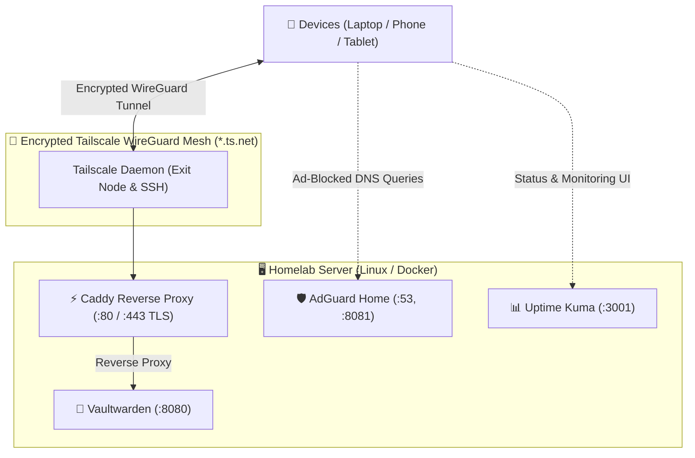

# Personal Cloud & Privacy Hub

A lightweight, production-grade, and self-hosted **Cloud & Privacy Hub** designed for minimal-resource servers (e.g., Oracle Cloud Always Free AMD Micro VM with 1 GB RAM, Raspberry Pi, or any Linux VPS).

> 📖 **Complete Step-by-Step Replication Guide**: See [`SETUP_AND_REPLICATION_GUIDE.md`](SETUP_AND_REPLICATION_GUIDE.md) for full replication, day-2 operations, client troubleshooting, and backup/restore steps.

---

## 🏛️ Architecture Overview



- **Tailscale**: WireGuard-based zero-trust encrypted mesh network providing secure private access with Exit Node capabilities and Tailscale SSH.
- **Vaultwarden**: Lightweight self-hosted Bitwarden password manager (~16 MB RAM footprint).
- **AdGuard Home**: Network-wide ad/tracker blocker and encrypted DNS resolver (~18 MB RAM footprint).
- **Uptime Kuma**: Self-hosted monitoring dashboard tracking service health, response times, SSL certificates, and alerting (~22 MB RAM footprint).
- **Caddy**: High-performance reverse proxy for internal routing and automatic TLS termination via Tailscale local daemon.
- **Total Resource Footprint**: Under ~60 MB RAM idle, strictly capped via Docker resource constraints.

---

## 🔒 Zero Domain & Free SSL Model

Modern browsers enforce the **WebCrypto API standard**, requiring HTTPS to encrypt and decrypt password vaults. 

This repository leverages **Tailscale MagicDNS** to eliminate the need for:
- ❌ Purchasing a custom domain
- ❌ Managing public DNS records
- ❌ Manually provisioning SSL certificates
- ❌ Opening firewall ports 80/443 to the public internet

Tailscale provisions free, trusted **Let's Encrypt SSL certificates** automatically for your machine's `*.ts.net` address.

---

## 📁 Repository Structure

```
.
├── .env                      # Active environment configuration (0600 permissions)
├── .env.example              # Sample environment configuration template
├── .gitignore                # Security-hardened gitignore for data and secrets
├── Caddyfile                 # Reverse proxy configuration with Tailscale TLS
├── docker-compose.yml        # Multi-container service definitions with resource limits
├── SETUP_AND_REPLICATION_GUIDE.md # Detailed operations, replication & disaster recovery guide
├── implementation_plan.md    # Detailed architecture and implementation specification
├── walkthrough.md            # Post-setup validation & verification walkthrough
├── rollback.sh -> scripts/rollback.sh  # Root symlink for quick teardown
├── scripts/
│   ├── backup_homelab.sh     # Automated SQLite & configuration snapshot with 14-day rotation
│   ├── deploy_stack.sh       # 1-command automated stack deployment & DNS resolver setup
│   ├── healthcheck.sh        # Complete stack health, security, and resource diagnostic tool
│   ├── rollback.sh           # Comprehensive teardown and server reversion script
│   └── update_vaultwarden.sh # Minimal-downtime Vaultwarden updater with live SQLite backup
└── LICENSE                   # MIT License
```

---

## 🚀 Quickstart & Fast Replication

### Prerequisites
- Ubuntu 22.04 / 24.04 LTS (or Debian-based Linux distribution)
- Tailscale account (Free tier)
- *(Optional but recommended)*: Run baseline OS hardening, performance tuning, and SSH customization from [`ubuntu-scripts`](https://github.com/sanjay-namdeo/ubuntu-scripts) before deploying services.

### 1. Automated Stack Deployment
Run the automated deployment script to deploy the full homelab stack:
```bash
sudo bash scripts/deploy_stack.sh
```
*This handles DNS stub preparation, Docker & Tailscale verification, dynamic Caddyfile generation, and container startup.*

---

## ⚙️ Service Access & First-Time Configuration

### Step 1: Enable Tailscale MagicDNS & Free HTTPS
1. Go to your **[Tailscale Admin Console → DNS](https://login.tailscale.com/admin/dns)**.
2. Ensure **MagicDNS** is toggled **ON**.
3. Under **HTTPS Certificates**, toggle **Enable HTTPS**.

### Step 2: Access & Setup Applications
From any device (laptop, phone) connected to your Tailscale network:

| Service | Access URL | Initial Setup Action |
| :--- | :--- | :--- |
| **Vaultwarden** | `https://<node>.<tailnet>.ts.net` | Create your master password account and link your Bitwarden browser extension / mobile app. |
| **AdGuard Home** | `http://<tailscale-ip>:8081` *(or `:3000` on first run)* | Complete initial wizard (listen port 80 / 53) and select upstream DNS (e.g. Cloudflare DoH `https://cloudflare-dns.com/dns-query`). |
| **Ad-Blocking Everywhere** | In Tailscale DNS settings | Set your server's Tailscale IP (`100.x.y.z`) as the **Global Nameserver** with *Override local DNS* enabled. |

### Step 3: Lock Down Registrations (Post-Setup Security)
After registering your primary user account in Vaultwarden, lock down signups:
1. Edit `.env` and set:
   ```ini
   SIGNUPS_ALLOWED=false
   ```
2. Apply changes:
   ```bash
   docker compose up -d vaultwarden
   ```

---

## 🔄 Host Reboots & Service Lifecycle

The entire stack is configured for **high resilience and automatic persistence**:

### Automatic Autostart
All containers are configured with `restart: unless-stopped`, and `tailscaled` is enabled via systemd. When the host reboots:
1. Kernel optimizations (`vm.swappiness=15`, IP forwarding) are restored automatically via `/etc/sysctl.d/99-homelab.conf`.
2. Port 53 stub listener bypass is applied automatically via `/etc/systemd/resolved.conf.d/adguard.conf`.
3. Tailscale automatically reconnects and restores the WireGuard tunnel and Exit Node routing.
4. Vaultwarden, AdGuard Home, Uptime Kuma, and Caddy automatically start up.

### Post-Reboot Verification
Allow **10–15 seconds** after boot for containers to initialize upstream DNS connections, then run:
```bash
sudo bash scripts/healthcheck.sh
```

### Manual Restart Commands
```bash
# Restart the entire stack:
docker compose restart

# Restart a single service:
docker compose restart vaultwarden
docker compose restart adguardhome
docker compose restart uptime-kuma
docker compose restart caddy

# Reload Caddy proxy configuration with zero downtime:
docker compose exec caddy caddy reload --config /etc/caddy/Caddyfile
```

---

## 🛠️ Operations & Automation Scripts

The [`scripts/`](scripts/) directory contains a suite of automation tools:

| Script | Purpose | Key Details |
| :--- | :--- | :--- |
| [`deploy_stack.sh`](scripts/deploy_stack.sh) | **1-Command Setup** | Prepares systemd-resolved, installs Docker & Tailscale, generates Caddyfile with TLS, and starts services. |
| [`healthcheck.sh`](scripts/healthcheck.sh) | **5-Tier Diagnostics** | Tests Tailscale mesh, Docker containers, HTTPS / DNS / Web UI endpoints, WAN port isolation, and RAM/disk. |
| [`backup_homelab.sh`](scripts/backup_homelab.sh) | **Automated Backups** | Online hot-backup for SQLite (zero WAL corruption), archives configs & `.env` (`0600`), 14-day auto-rotation. |
| [`update_vaultwarden.sh`](scripts/update_vaultwarden.sh) | **Zero-Downtime Updates** | Pre-pulls new layers while running, takes safety SQLite snapshot, hot-swaps container (~1-2s), verifies health. |
| [`rollback.sh`](scripts/rollback.sh) | **Complete Teardown** | Stops containers, purges Docker & Tailscale, restores system DNS, and wipes `/opt/homelab`. |

---

## 🔄 Minimal-Downtime Updates

To update Vaultwarden without taking down your DNS or proxy, and keeping Vaultwarden downtime to ~1-2 seconds:

### Automated (Recommended)
```bash
sudo bash scripts/update_vaultwarden.sh
```
*This script automatically pre-pulls the latest image while the server is running, creates a live point-in-time SQLite snapshot, hot-swaps the container, and verifies health.*

### Manual Step-by-Step
```bash
cd /opt/homelab
# 1. Download image layers in advance while service is online (0s downtime)
docker compose pull vaultwarden

# 2. Hot-swap container (~1-2s restart)
docker compose up -d vaultwarden
```

---

## 💾 Automated Backups & Cloudflare R2 Off-Site Sync

Run an instant, live point-in-time snapshot of the entire homelab (Vaultwarden SQLite database, AdGuard filters & configs, Caddy TLS state, and `.env`):
```bash
sudo bash scripts/backup_homelab.sh
```
*Snapshots are saved to `/opt/homelab/data/backups/` as permission-locked (`0600`) archives with automatic 14-day rotation, and automatically synced with **Zero-Knowledge AES-256 client-side encryption** to **Cloudflare R2 Object Storage** via `rclone`.*


---

## 🩺 Stack Health & Security Diagnostics

Perform an instant full-stack validation (Tailscale connectivity, container health, HTTPS endpoint, DNS filtering, WAN isolation, and resource usage):
```bash
sudo bash scripts/healthcheck.sh
```

---

## 🧹 Complete Teardown & Rollback

If you ever need to completely remove all services, data, and packages, returning your server to a clean state:
```bash
sudo bash scripts/rollback.sh
```

---

## 📄 License

This project is open-source and licensed under the [MIT License](LICENSE).

