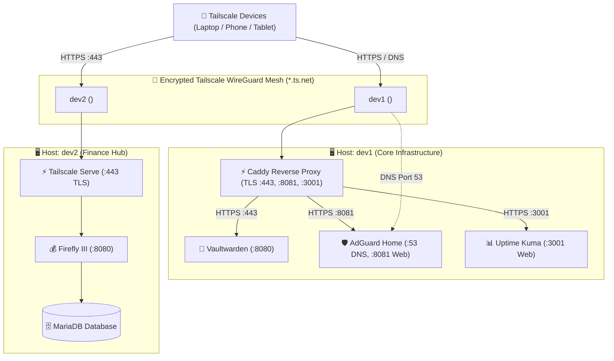

# Personal Cloud & Multi-Host Homelab

A lightweight, production-grade, and self-hosted **Homelab Infrastructure** organized as a multi-host monorepo for resource-efficient servers (e.g., 1 GB RAM cloud VMs, Raspberry Pis, or home servers).

---

## 🏛️ Multi-Host Architecture Overview



---

## 🔒 Zero Domain & Free SSL Model

Modern browsers enforce the **WebCrypto API standard**, requiring HTTPS to encrypt and decrypt password vaults. 

This repository leverages **Tailscale MagicDNS** and **Tailscale TLS** to eliminate the need for:
- ❌ Purchasing a custom domain
- ❌ Managing public DNS records
- ❌ Manually provisioning SSL certificates
- ❌ Opening firewall ports 80/443 to the public internet

Tailscale provisions free, trusted **Let's Encrypt SSL certificates** automatically for your machine's `*.ts.net` address across all hosted services (Vaultwarden, AdGuard Home, Uptime Kuma on dev1; Firefly III on dev2).

---

## 📁 Repository Structure (Directory-per-Host)

```text
homelab/
├── hosts/
│   ├── dev1/                      # Host dev1: Core Privacy & Cloud Stack
│   │   ├── docker-compose.yml     # Vaultwarden, AdGuard Home, Uptime Kuma, Caddy
│   │   ├── Caddyfile              # Tailscale TLS reverse proxy configuration
│   │   ├── .env.example
│   │   └── README.md
│   │
│   └── dev2/                      # Host dev2: Personal Finance Stack
│       ├── docker-compose.yml     # Firefly III & MariaDB (tuned for 1GB RAM)
│       ├── .env.example
│       └── README.md
│
├── scripts/                       # Shared operational automation
│   ├── deploy_stack.sh           # Automated deployment with host auto-detection
│   ├── backup_homelab.sh         # Online hot-backup (SQLite / MariaDB) & R2 sync
│   ├── healthcheck.sh            # 5-tier diagnostic & network isolation verification
│   ├── restore_homelab.sh        # Point-in-time disaster recovery & validation
│   ├── rollback.sh               # Complete teardown and clean server reversion
│   └── update_vaultwarden.sh     # Minimal-downtime container updater
│
├── Caddyfile                      # dev1 root proxy configuration (backward compatibility)
├── docker-compose.yml             # dev1 root compose definition (backward compatibility)
├── .gitignore                     # Protects all .env files and runtime data directories
├── README.md                      # Central homelab overview
└── SETUP_AND_REPLICATION_GUIDE.md # Detailed replication and day-2 operations guide
```

---

## 🚀 Quick Deployment Guide

### Deploying on `dev1` (Core Stack)
```bash
# Automated deployment (recommended):
sudo bash scripts/deploy_stack.sh

# Or manual deployment:
cd /opt/homelab/hosts/dev1
cp .env.example .env      # Set passwords / domain variables
docker compose up -d
```
- **Vaultwarden**: `https://dev1.<tailnet>.ts.net`
- **AdGuard Home**: `https://dev1.<tailnet>.ts.net:8081`
- **Uptime Kuma**: `https://dev1.<tailnet>.ts.net:3001`

### Deploying on `dev2` (Firefly III)
```bash
# Automated deployment (recommended):
sudo bash scripts/deploy_stack.sh dev2

# Or manual deployment:
cd /opt/homelab/hosts/dev2
cp .env.example .env      # Generates APP_KEY and DB_PASSWORD
docker compose up -d

# Enable Tailscale Serve (HTTPS termination)
sudo tailscale serve --bg --https=443 http://127.0.0.1:8080
```
- **Firefly III**: `https://dev2.<tailnet>.ts.net`

---

## ⚙️ Service Access & First-Time Configuration

### Step 1: Enable Tailscale MagicDNS & Free HTTPS
1. Go to your **[Tailscale Admin Console → DNS](https://login.tailscale.com/admin/dns)**.
2. Ensure **MagicDNS** is toggled **ON**.
3. Under **HTTPS Certificates**, toggle **Enable HTTPS**.

### Step 2: Access & Setup Applications
From any device (laptop, phone) connected to your Tailscale network:

| Host | Service | Access URL | Initial Setup Action |
| :--- | :--- | :--- | :--- |
| **dev1** | **Vaultwarden** | `https://dev1.<tailnet>.ts.net` | Create master password account & link Bitwarden apps. |
| **dev1** | **AdGuard Home** | `https://dev1.<tailnet>.ts.net:8081` | Complete wizard (port 80/53) & upstream DNS (Cloudflare DoH). |
| **dev1** | **Uptime Kuma** | `https://dev1.<tailnet>.ts.net:3001` | Create admin account & configure alert notifications. |
| **dev2** | **Firefly III** | `https://dev2.<tailnet>.ts.net` | Set up initial financial accounts and budgets. |

---

## 🛠️ Operations & Automation Scripts

The [`scripts/`](scripts/) directory contains a full suite of automation tools:

| Script | Purpose | Key Details |
| :--- | :--- | :--- |
| [`deploy_stack.sh`](scripts/deploy_stack.sh) | **Automated Setup** | Prepares systemd-resolved, Docker, Tailscale, generates TLS configs, and starts stack. |
| [`healthcheck.sh`](scripts/healthcheck.sh) | **5-Tier Diagnostics** | Tests Tailscale mesh, Docker containers, HTTPS / DNS endpoints, WAN port isolation, and RAM/disk. |
| [`backup_homelab.sh`](scripts/backup_homelab.sh) | **Automated Backups** | Online hot-backup (SQLite/MariaDB), archives configs & `.env` (`0600`), 14-day auto-rotation, R2 sync. |
| [`restore_homelab.sh`](scripts/restore_homelab.sh) | **Disaster Recovery** | Point-in-time state extraction, SQLite / SQL integrity validation, supports dry-run isolated testing. |
| [`update_vaultwarden.sh`](scripts/update_vaultwarden.sh) | **Zero-Downtime Updates** | Pre-pulls new layers while running, takes safety SQLite snapshot, hot-swaps container (~1-2s). |
| [`rollback.sh`](scripts/rollback.sh) | **Complete Teardown** | Stops containers, purges Docker & Tailscale, restores system DNS, and wipes `/opt/homelab`. |

---

## 🔒 Security Model
- **Zero Public Port Exposure**: All endpoints bind strictly to `127.0.0.1` or the private Tailscale interface (`100.64.0.0/10`).
- **Free Automated TLS**: Endpoints use automated Let's Encrypt certificates managed seamlessly via Tailscale MagicDNS (`*.ts.net`).
- **RAM-Tuned**: Strict Docker memory limits and MySQL/MariaDB performance optimization prevent OOM crashes on 1 GB RAM instances.
