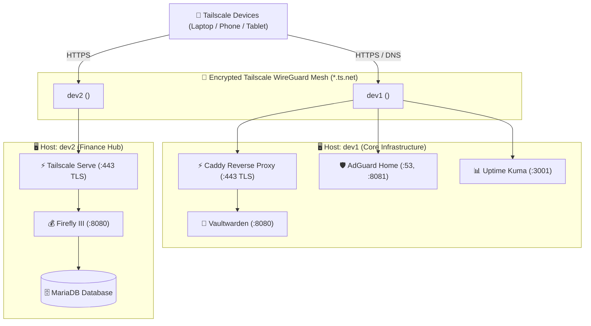

# Personal Cloud & Multi-Host Homelab

A lightweight, production-grade, and self-hosted **Homelab Infrastructure** organized as a multi-host monorepo for resource-efficient servers (e.g., 1 GB RAM cloud VMs, Raspberry Pis, or home servers).

---

## 🏛️ Multi-Host Architecture Overview



---

## 📁 Repository Structure (Directory-per-Host)

```text
homelab/
├── hosts/
│   ├── dev1/                      # Host dev1: Core Privacy & Cloud Stack
│   │   ├── docker-compose.yml     # Vaultwarden, AdGuard Home, Uptime Kuma, Caddy
│   │   ├── Caddyfile              # Tailscale TLS socket configuration
│   │   ├── .env.example
│   │   └── README.md
│   │
│   └── dev2/                      # Host dev2: Personal Finance Stack
│       ├── docker-compose.yml     # Firefly III & MariaDB (tuned for 1GB RAM)
│       ├── .env.example
│       └── README.md
│
├── scripts/                       # Shared operational automation
│   ├── deploy_stack.sh
│   ├── backup_homelab.sh
│   ├── healthcheck.sh
│   ├── restore_homelab.sh
│   └── rollback.sh
│
├── .gitignore                     # Protects all .env files and runtime data directories
├── README.md                      # Central homelab overview
└── SETUP_AND_REPLICATION_GUIDE.md # Detailed replication and day-2 operations guide
```

---

## 🚀 Quick Deployment Guide

### Deploying on `dev1` (Core Stack)
```bash
cd /opt/homelab/hosts/dev1
cp .env.example .env      # Set passwords / domain variables
docker compose up -d
```
- **Vaultwarden**: `https://dev1.<tailnet>.ts.net`
- **AdGuard Home**: `http://<tailscale-ip>:8081`
- **Uptime Kuma**: `http://<tailscale-ip>:3001`

### Deploying on `dev2` (Firefly III)
```bash
cd /opt/homelab/hosts/dev2
cp .env.example .env      # Generates APP_KEY and DB_PASSWORD
docker compose up -d

# Enable Tailscale Serve (HTTPS termination)
sudo tailscale serve --bg --https=443 http://127.0.0.1:8080
```
- **Firefly III**: `https://dev2.<tailnet>.ts.net`

---

## 🔒 Security Model
- **Zero Public Port Exposure**: All endpoints bind strictly to `127.0.0.1` or the private Tailscale interface (`100.64.0.0/10`).
- **Free Automated TLS**: Endpoints use automated Let's Encrypt certificates managed seamlessly via Tailscale MagicDNS (`*.ts.net`).
- **RAM-Tuned**: Strict Docker memory limits and MySQL performance optimization prevent OOM crashes on 1 GB RAM instances.
