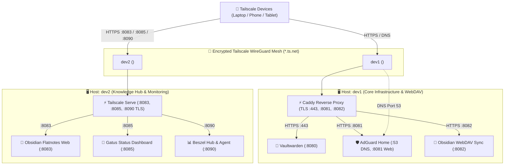

# Personal Cloud & Multi-Host Homelab

A lightweight, production-grade, and self-hosted **Homelab Infrastructure** organized as a multi-host monorepo for resource-efficient servers (e.g., 1 GB RAM cloud VMs, Raspberry Pis, or home servers).

---

## 🏛️ Multi-Host Architecture Overview



---

## 🔒 Zero Domain & Free SSL Model

Modern browsers enforce the **WebCrypto API standard**, requiring HTTPS to encrypt and decrypt password vaults. 

This repository leverages **Tailscale MagicDNS** and **Tailscale TLS** to eliminate the need for:
- ❌ Purchasing a custom domain
- ❌ Managing public DNS records
- ❌ Manually provisioning SSL certificates
- ❌ Opening firewall ports 80/443 to the public internet

Tailscale provisions free, trusted **Let's Encrypt SSL certificates** automatically for your machine's `*.ts.net` address across all hosted services.

---

## 📁 Repository Structure (Directory-per-Host)

```text
homelab/
├── hosts/
│   ├── dev1/                      # Host dev1: Core Privacy & Cloud Stack
│   │   ├── docker-compose.yml     # Vaultwarden, AdGuard Home, Obsidian WebDAV, Caddy, Beszel Agent
│   │   ├── Caddyfile              # Tailscale TLS reverse proxy configuration
│   │   ├── .env.example
│   │   └── README.md
│   │
│   └── dev2/                      # Host dev2: Knowledge & Monitoring Stack
│       ├── docker-compose.yml     # Obsidian Flatnotes, Gatus & Beszel (tuned for 1GB RAM)
│       ├── gatus/                 # Gatus status dashboard YAML configuration
│       │   └── config.yaml        # Service endpoints & Brevo SMTP alerting
│       ├── .env.example
│       └── README.md
│
├── notes/                         # Obsidian & Flatnotes Knowledge Base Vault
│   ├── 00 - Homelab Hub.md        # Master Map of Content & Live Dashboard
│   ├── 01 - Architecture - *.md   # Topology, Specifications, Network & Security
│   ├── 02 - Service - *.md        # Vaultwarden, AdGuard, Gatus, Obsidian, Beszel
│   ├── 03 - Guide - *.md          # Operations, Email Alerting (Brevo), Obsidian & Beszel Setup
│   ├── 04 - Disaster Recovery - *.md # Backup Strategy, Restore & Host Runbooks
│   ├── Template - *.md            # Note Templates for Services, Guides & Runbooks
│   └── .obsidian/                 # Obsidian Vault App & Plugin Configuration
│
├── scripts/                       # Shared operational automation
│   ├── deploy_stack.sh           # Automated deployment with host auto-detection
│   ├── backup_homelab.sh         # Online hot-backup (SQLite) & R2 sync
│   ├── restore_homelab.sh        # Point-in-time disaster recovery & validation
│   ├── test_disaster_recovery.sh # Automated catastrophic failure & Cloudflare R2 DR drill
│   ├── healthcheck.sh            # 5-tier diagnostic & network isolation verification
│   ├── sync_vault_dev2.sh        # 1-minute bidirectional sync between dev2 & dev1 WebDAV
│   ├── sync_notes_to_vault.sh    # Syncs git notes to live Obsidian/Flatnotes vault
│   ├── update_vaultwarden.sh     # Minimal-downtime container updater
│   └── rollback.sh               # Complete teardown and clean server reversion
│
├── Caddyfile                      # dev1 root proxy configuration (backward compatibility)
├── docker-compose.yml             # dev1 root compose definition (backward compatibility)
├── .gitignore                     # Protects all .env files and runtime data directories
├── README.md                      # Central homelab overview
└── SETUP_AND_REPLICATION_GUIDE.md # Detailed replication and day-2 operations guide
```

---

## 📚 Knowledge Base & Flatnotes Web Editor

All infrastructure documentation, service guides, backup strategies, and disaster recovery runbooks are curated as an Obsidian-compliant knowledge vault in [`notes/`](file:///opt/homelab/notes/) and accessible via the **Flatnotes Web Editor** at `https://dev2.<tailnet>.ts.net:8083` or synced natively to Obsidian Desktop/Mobile via WebDAV.

| Section | Topic & Files |
| :--- | :--- |
| **Hub / Dashboard** | [`00 - Homelab Hub.md`](file:///opt/homelab/notes/00%20-%20Homelab%20Hub.md) — Master Map of Content, Service Directory & Status |
| **01 - Architecture** | [`01 - Architecture - Homelab Topology.md`](file:///opt/homelab/notes/01%20-%20Architecture%20-%20Homelab%20Topology.md), Specs, Ingress, Network, Security |
| **02 - Services** | [`02 - Service - Vaultwarden.md`](file:///opt/homelab/notes/02%20-%20Service%20-%20Vaultwarden.md), AdGuard Home, Obsidian WebDAV, Flatnotes, Gatus, Beszel |
| **03 - Operations** | [`03 - Guide - Operations, Maintenance & Troubleshooting.md`](file:///opt/homelab/notes/03%20-%20Guide%20-%20Operations,%20Maintenance%20&%20Troubleshooting.md), Email Alerting (Brevo), Obsidian Setup, Beszel Setup |
| **04 - Disaster Recovery** | [`04 - Disaster Recovery - Backup & Off-Site Sync.md`](file:///opt/homelab/notes/04%20-%20Disaster%20Recovery%20-%20Backup%20&%20Off-Site%20Sync%20(Cloudflare%20R2).md), Restore, `dev1` Runbook, `dev2` Runbook, Live Drill Protocol |
| **Templates** | Reusable templates for new Services, Guides, DR Runbooks, and Architecture Specs |

---

## 🚀 Quick Deployment Guide

### Deploying on `dev1` (Core Stack & WebDAV Sync)
```bash
# Automated deployment (recommended):
sudo bash scripts/deploy_stack.sh

# Or manual deployment:
cd /opt/homelab/hosts/dev1
cp .env.example .env      # Set passwords / domain variables
docker compose up -d
```
- **Vaultwarden**: `https://dev1.<tailnet>.ts.net`
- **AdGuard Home**: `https://dev1.<tailnet>.ts.net:8081`
- **Obsidian WebDAV Sync**: `https://dev1.<tailnet>.ts.net:8082/data/`

### Deploying on `dev2` (Knowledge Hub & Server Monitoring)
```bash
# Automated deployment (recommended):
sudo bash scripts/deploy_stack.sh dev2

# Or manual deployment:
cd /opt/homelab/hosts/dev2
cp .env.example .env
docker compose up -d

# Enable Tailscale Serve (HTTPS termination)
sudo tailscale serve --bg --https=8083 http://127.0.0.1:8083
sudo tailscale serve --bg --https=8085 http://127.0.0.1:8085
sudo tailscale serve --bg --https=8090 http://127.0.0.1:8090
```
- **Obsidian Flatnotes Web**: `https://dev2.<tailnet>.ts.net:8083`
- **Gatus Status Dashboard**: `https://dev2.<tailnet>.ts.net:8085`
- **Beszel Server Health Hub**: `https://dev2.<tailnet>.ts.net:8090`

---

## ⚙️ Service Access & First-Time Configuration

### Step 1: Enable Tailscale MagicDNS & Free HTTPS
1. Go to your **[Tailscale Admin Console → DNS](https://login.tailscale.com/admin/dns)**.
2. Ensure **MagicDNS** is toggled **ON**.
3. Under **HTTPS Certificates**, toggle **Enable HTTPS**.

### Step 2: Access & Setup Applications
From any device (laptop, phone) connected to your Tailscale network:

| Host | Service | Access URL | Initial Setup Action |
| :--- | :--- | :--- | :--- |
| **dev1** | **Vaultwarden** | `https://dev1.<tailnet>.ts.net` | Create master password account & link Bitwarden apps. |
| **dev1** | **AdGuard Home** | `https://dev1.<tailnet>.ts.net:8081` | Complete wizard (port 80/53) & upstream DNS (Cloudflare DoH). |
| **dev1** | **Obsidian WebDAV** | `https://dev1.<tailnet>.ts.net:8082/data/` | Configure *Remotely Save* plugin in Obsidian Desktop / Mobile. |
| **dev2** | **Obsidian Web Editor** | `https://dev2.<tailnet>.ts.net:8083` | Log in with configured credentials to view and edit notes in browser. |
| **dev2** | **Gatus Status Dashboard** | `https://dev2.<tailnet>.ts.net:8085` | Real-time automated health status hub and Brevo SMTP alerting. |
| **dev2** | **Beszel Health Hub** | `https://dev2.<tailnet>.ts.net:8090` | Create admin account & link systems via `/beszel_socket/beszel.sock`. |

---

## 🛠️ Operations & Automation Scripts

The [`scripts/`](scripts/) directory contains a full suite of automation tools:

| Script | Purpose | Key Details |
| :--- | :--- | :--- |
| [`deploy_stack.sh`](scripts/deploy_stack.sh) | **Automated Setup** | Prepares systemd-resolved, Docker, Tailscale, generates TLS configs, and starts stack. |
| [`healthcheck.sh`](scripts/healthcheck.sh) | **5-Tier Diagnostics** | Tests Tailscale mesh, Docker containers, HTTPS / DNS endpoints, WAN port isolation, and RAM/disk. |
| [`backup_homelab.sh`](scripts/backup_homelab.sh) | **Automated Backups** | Online hot-backup (SQLite), archives configs & `.env` (`0600`), 14-day auto-rotation, Cloudflare R2 sync. |
| [`restore_homelab.sh`](scripts/restore_homelab.sh) | **Disaster Recovery** | Point-in-time state extraction, SQLite integrity validation, supports dry-run isolated testing. |
| [`test_disaster_recovery.sh`](scripts/test_disaster_recovery.sh) | **Automated DR Drill** | Simulates total catastrophic failure and verifies 100% data recovery parity directly from Cloudflare R2. |
| [`sync_vault_dev2.sh`](scripts/sync_vault_dev2.sh) | **Vault Sync** | 1-minute automated bidirectional sync between dev2 Flatnotes and dev1 Obsidian WebDAV. |
| [`sync_notes_to_vault.sh`](scripts/sync_notes_to_vault.sh) | **Git Notes Ingest** | Copies repository markdown notes to active runtime vault volumes. |
| [`update_vaultwarden.sh`](scripts/update_vaultwarden.sh) | **Zero-Downtime Updates** | Pre-pulls new layers while running, takes safety SQLite snapshot, hot-swaps container (~1-2s). |
| [`rollback.sh`](scripts/rollback.sh) | **Complete Teardown** | Stops containers, purges Docker & Tailscale, restores system DNS, and wipes `/opt/homelab`. |

---

## ☁️ Disaster Recovery & Off-Site Replication (Cloudflare R2)

Our disaster recovery model guarantees zero data loss (RPO = 0) and rapid recovery (RTO < 5 minutes):

1. **Atomic SQLite Hot Snapshots**: Uses Python's native `sqlite3.backup()` API to capture WAL-consistent database snapshots without container restarts or table locks.
2. **Zero-Knowledge Encrypted Cloud Replication**: Backups are encrypted client-side using AES-256 via `rclone` and replicated offsite to Cloudflare R2 (`r2-crypt:`).
3. **Automated Daily Systemd Timers**: Systemd timers (`homelab-backup.timer` and `homelab-backup.service`) run nightly at 03:00 UTC with persistent missed-job catchup.
4. **1-Command Catastrophic Recovery Drill**:
   ```bash
   # Run the complete automated disaster recovery simulation drill:
   sudo bash /opt/homelab/scripts/test_disaster_recovery.sh

   # Or restore a specific backup archive directly from Cloudflare R2:
   rclone copy r2-crypt:<backup_filename>.tar.gz /opt/homelab/data/backups/ --config /opt/homelab/data/rclone/rclone.conf
   sudo bash /opt/homelab/scripts/restore_homelab.sh --latest
   ```

---

## 🔒 Security Model
- **Zero Public Port Exposure**: All endpoints bind strictly to `127.0.0.1` or the private Tailscale interface (`100.64.0.0/10`).
- **Free Automated TLS**: Endpoints use automated Let's Encrypt certificates managed seamlessly via Tailscale MagicDNS (`*.ts.net`).
- **RAM-Tuned**: Strict Docker memory limits prevent OOM crashes on 1 GB RAM instances.
