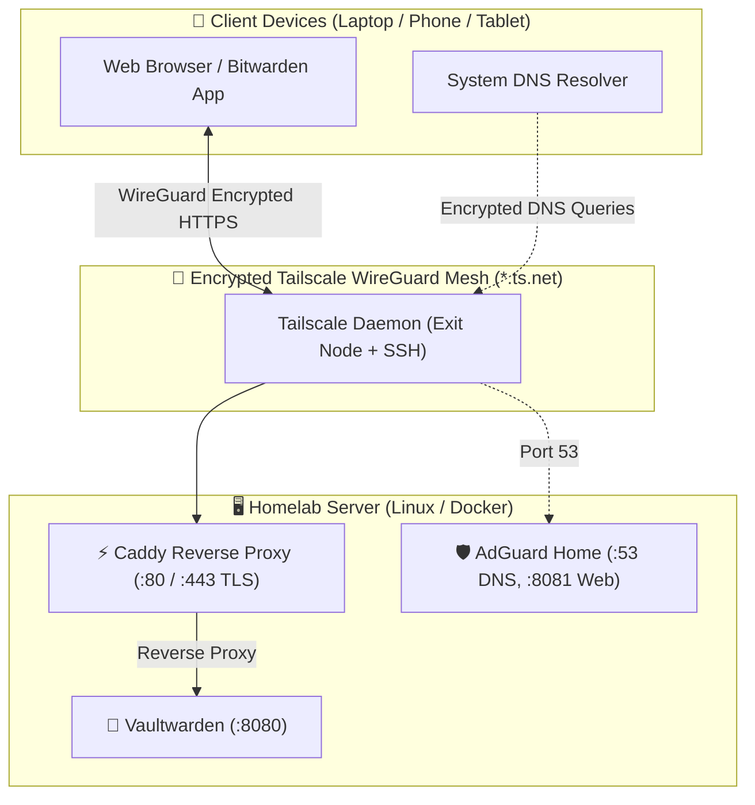
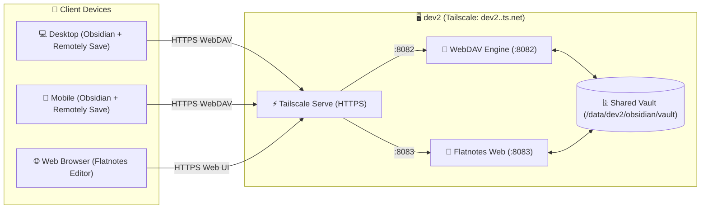
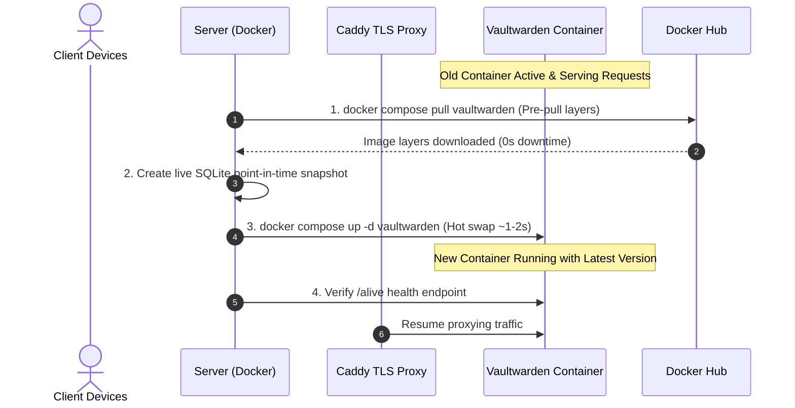

# Personal Cloud Hub: Setup & Full Replication Guide
> **Services**: Vaultwarden (Bitwarden) &bull; AdGuard Home &bull; Obsidian WebDAV &bull; Flatnotes Web &bull; Gatus Status &bull; Caddy Reverse Proxy &bull; Tailscale WireGuard Mesh  
> **Security Model**: Zero public internet exposure &bull; Zero domain cost &bull; Automated Let's Encrypt TLS via Tailscale MagicDNS

---

## 🏛️ Architecture & Overview



### Key Highlights
- **Zero Public Ports**: No ports (80/443/53) are opened to the public internet. All traffic is tunneled through your private Tailscale WireGuard mesh (`100.64.0.0/10`).
- **Free Automated SSL**: Uses Tailscale's native integration with Let's Encrypt to provision browser-trusted TLS certificates for `https://<node>.<tailnet>.ts.net` without purchasing a domain.
- **Ultra-Lightweight**: Entire stack consumes under ~30 MB idle RAM, with hard Docker resource caps preventing OOM on 1GB RAM machines (e.g. Oracle Cloud AMD Micro VM, Raspberry Pi).

---

## 🚀 Fast Replication on a New Server (1-Command Flow)

To replicate this exact setup on any fresh Ubuntu (22.04 / 24.04 LTS) or Debian server:

### Step 1: Baseline Server Hardening (Optional)
If provisioning a brand-new cloud instance or bare-metal Ubuntu machine, you can run baseline hardening and performance tuning from [`ubuntu-scripts`](https://github.com/sanjay-namdeo/ubuntu-scripts):
```bash
git clone https://github.com/sanjay-namdeo/ubuntu-scripts.git /tmp/ubuntu-scripts
sudo bash /tmp/ubuntu-scripts/setup_server.sh
sudo bash /tmp/ubuntu-scripts/tune_performance.sh
# Optional: Change SSH port
# sudo bash /tmp/ubuntu-scripts/change_ssh_port.sh 28422
rm -rf /tmp/ubuntu-scripts
```

### Step 2: Clone Homelab Repository
```bash
sudo git clone git@github.com:sanjay-namdeo/homelab.git /opt/homelab
cd /opt/homelab
```

### Step 3: Run Automated Stack Deployment
```bash
sudo bash scripts/deploy_stack.sh
```
*The script automatically:*
1. Configures `systemd-resolved` to disable port 53 stub listener (freeing port 53 for AdGuard).
2. Enables kernel IP forwarding for Exit Node routing.
3. Installs Docker Engine, Docker Compose, and Tailscale (if missing).
4. Authenticates Tailscale and detects your server's Tailscale domain name (`<machine>.<tailnet>.ts.net`).
5. Generates the [`Caddyfile`](file:///opt/homelab/Caddyfile) with `tls { get_certificate tailscale }`.
6. Initializes persistent data directories and launches containers via Docker Compose.

---

## 🔑 Vaultwarden Configuration Walkthrough

### 1. Initial User Registration
1. On your laptop or phone connected to Tailscale, open:
   👉 **`https://<server-name>.<tailnet>.ts.net`**
2. Click **Create account**.
3. Set your email address and create a strong Master Password.
4. Log into your web vault.

### 2. Connect Bitwarden Client Apps
In the official Bitwarden Mobile App / Browser Extension:
1. On the login screen, click the **Gear icon (Settings)** at the top left.
2. Under **Server URL**, enter:
   ```text
   https://<server-name>.<tailnet>.ts.net
   ```
3. Log in with your email and master password.

### 3. Lock Down Registrations (Security Hardening)
Once your account is created, disable new registrations:
1. Edit `/opt/homelab/.env`:
   ```ini
   SIGNUPS_ALLOWED=false
   ```
2. Restart Vaultwarden:
   ```bash
   docker compose -f /opt/homelab/docker-compose.yml up -d vaultwarden
   ```

### 4. Email & Notification Delivery (Brevo SMTP)
Vaultwarden uses Brevo's free transactional SMTP relay (300 emails/day, 0 MB server RAM overhead) configured in `/opt/homelab/.env`:
```ini
SMTP_HOST=smtp-relay.brevo.com
SMTP_PORT=587
SMTP_SECURITY=starttls
SMTP_USERNAME=<your-smtp-login-email>
SMTP_PASSWORD=<your-brevo-smtp-key>
SMTP_FROM=vaultwarden@yourdomain.com
SMTP_FROM_NAME=Vaultwarden
SMTP_TIMEOUT=15
SMTP_AUTH_MECHANISM=Auto
```
*Note: To change the sender address or provider, update `.env` and run `docker compose up -d vaultwarden`.*

### 5. Optional: Temporarily Enabling the Admin Panel
If you ever need to access the `/admin` portal (e.g. to view diagnostic logs or user accounts):
1. Generate an admin token and set it in `/opt/homelab/.env`:
   ```ini
   ADMIN_TOKEN=your-random-secret-token-here
   ```
2. Edit `/opt/homelab/docker-compose.yml` to include:
   ```yaml
   environment:
     - ADMIN_TOKEN=${ADMIN_TOKEN}
   ```
3. Restart: `docker compose up -d vaultwarden`
4. Access: `https://<server-name>.<tailnet>.ts.net/admin`
5. **After configuration**, comment out `ADMIN_TOKEN` in `.env` and `docker-compose.yml`, then restart `vaultwarden` to disable the admin panel.

---

## 🛡️ AdGuard Home Configuration Walkthrough

### 1. Initial Setup Wizard
On a brand new deployment, open:
👉 **`http://<tailscale-ip>:3000`**

1. Click **Get Started**.
2. **Admin Web Interface**:
   - Listen Interface: **All interfaces**
   - Port: **`80`** *(mapped to host port `8081` by Docker)*
3. **DNS Server**:
   - Listen Interface: **All interfaces**
   - Port: **`53`**
4. Set your administrator username and password.
5. Finish the setup.

### 2. Post-Setup Dashboard Access
Access the dashboard anytime over HTTPS at:
👉 **`https://<tailscale-fqdn>:8081`** (e.g. `https://dev1.<tailnet>.ts.net:8081`)

### 3. Recommended DNS Settings
In AdGuard Home (**Settings ➔ DNS settings**):
- **Upstream DNS servers**:
  ```text
  https://cloudflare-dns.com/dns-query
  https://dns.quad9.net/dns-query
  ```
- **Upstream DNS mode**: Select **Parallel requests** *(queries all upstreams simultaneously for ultra-low latency)*.
- Click **Apply** and **Test upstreams**.

### 4. Recommended Filter Blocklists
In AdGuard Home (**Filters ➔ DNS blocklists**):
- Click **Add blocklist** ➔ **Choose from list**:
  - `AdGuard DNS filter` (Enabled by default)
  - `AdGuard Tracking Protection`
  - `AdGuard Annoyances filter`
- Click **Save**.

---

## 🔒 Post-Setup: Tailscale Integration

### 1. Global Ad-Blocking (All Devices)
Route all device DNS queries through your AdGuard Home container automatically:
1. Open **[Tailscale Admin Console → DNS](https://login.tailscale.com/admin/dns)**.
2. Under **Nameservers**, click **Add nameserver** ➔ **Custom...**
3. Enter your server's Tailscale IP (e.g. `100.x.y.z` from `.env`).
4. Toggle **Override local DNS** to **ON**.

### 2. Full Internet VPN (Exit Node Routing)
To route 100% of your internet traffic through this server:
1. In **[Tailscale Admin Console → Machines](https://login.tailscale.com/admin/machines)**:
   - Find your server node.
   - Click `...` ➔ **Edit route settings...** ➔ Check **"Use as exit node"** ➔ Save.
2. On Client Devices:
   - **Mobile App**: Tap **Exit Node** ➔ Select your server.
   - **Linux Laptop**: Run: `sudo tailscale up --exit-node=<server-name> --accept-dns=true`

### 3. Client Troubleshooting (Resolving DNS Bypasses)
- **Linux Laptop**: If MagicDNS names do not resolve, run `sudo tailscale up --accept-dns=true` or add `<tailscale-ip> <server-domain>` to `/etc/hosts`.
- **Browser Secure DNS (DoH)**: If Chrome/Brave/Firefox returns `NXDOMAIN`, go to Browser Settings ➔ Search "Secure DNS" ➔ Set to "OS Default" or OFF.
- **Android**: Set phone Settings ➔ Network ➔ **Private DNS** to **OFF** (Android Private DNS bypasses VPN DNS).
- **iOS**: Turn **iCloud Private Relay** to **OFF** in iCloud settings.

---

## 📊 Service Health & Monitoring Overview

The homelab utilizes **Gatus** (hosted on `dev2`) and **Beszel** (distributed across `dev1` & `dev2`) for comprehensive, zero-overhead infrastructure monitoring:

1. **Gatus Health & Status Hub (`dev2:8085`)**:
   - Declarative, code-defined endpoint monitoring for all core infrastructure services.
   - Built-in latency tracking, HTTP status validation, and DNS resolution testing.
   - Native Brevo SMTP email alerting on service failures and recoveries.
2. **Beszel Multi-Node Health Hub (`dev2:8090`)**:
   - Real-time CPU, RAM, disk, swap, network, and Docker container metrics.
   - Ultra-lightweight agents communicating via Unix sockets (`dev2`) and host ports (`dev1:45876`).
   - Automated threshold alerting.

For complete setup and configuration details, refer to the **Gatus** and **Beszel** sections below.

---

---

## 📱 Obsidian Knowledge Hub: Multi-Platform Sync & Client Setup Guide

The `dev2` server hosts a centralized, bidirectional Markdown knowledge base synchronized across **Desktop (Windows, macOS, Linux)**, **Mobile (iOS, Android)**, and **Web Browsers**.



### 1. Desktop Client Configuration (Windows / macOS / Linux)

1. **Install Obsidian**: Download from [obsidian.md](https://obsidian.md).
2. **Open / Create Local Vault**: Open an existing vault folder or create a new one (e.g., `Notes`).
3. **Install "Remotely Save" Plugin**:
   - Go to **Settings ⚙️ ➔ Community Plugins**.
   - Click **Turn on community plugins** (disables Restricted Mode).
   - Click **Browse**, search for **`Remotely Save`** (by *fyears* / *sboersma*), then click **Install** and **Enable**.
4. **Configure WebDAV Parameters**:
   - In **Settings ⚙️ ➔ Community Plugins ➔ Remotely Save (Settings icon ⚙️)**:
     - **Choose Sync Service**: `Webdav`
     - **Server Address**: `https://dev2.<tailnet>.ts.net:8082/data/` (or `https://dev2.<tailnet>.ts.net:8082/data/`)
     - **Username**: `obsidian` (from `hosts/dev2/.env`)
     - **Password**: `<YOUR_WEBDAV_PASSWORD>` (from `hosts/dev2/.env`)
     - **Auth Type**: `Basic`
     - *(Optional)* **End-to-End Encryption**: Enable password encryption if desired (must use identical password on all devices).
5. **Set Sync Automation**:
   - **Auto run after starting Obsidian**: Enable (5s delay).
   - **Auto run every**: `5 minutes` or `10 minutes`.
   - **Sync on save / file change**: Enable.
6. **Verify Connection & Initial Sync**:
   - Click **Check Connection** (shows a green `Success` notice).
   - Click the **Sync Icon (two circular arrows)** in the left sidebar ribbon to execute the initial sync.

---

### 2. Mobile Client Configuration (iOS & Android)

1. **Install Obsidian**: From Apple App Store or Google Play Store.
2. **Tailscale Connection**: Ensure Tailscale is connected on your mobile device.
3. **Create Vault**: Open Obsidian and create an empty vault named `Notes`.
4. **Install Remotely Save**:
   - Navigate to **Settings ⚙️ ➔ Community plugins ➔ Turn on community plugins**.
   - Search for **`Remotely Save`** ➔ Install ➔ Enable.
5. **Configure Credentials**:
   - **Sync Service**: `Webdav`
   - **Server Address**: `https://dev2.<tailnet>.ts.net:8082/data/`
   - **Username**: `obsidian`
   - **Password**: `<YOUR_WEBDAV_PASSWORD>`
   - **Auth Type**: `Basic`
   - **Auto-Sync**: Enable on app startup.
6. **Run Sync**:
   - Tap **Check Connection** ➔ Tap the **Sync Icon** in the sidebar ribbon. Your full vault synchronizes to your device.

---

### 3. Web Browser Access (Any Machine)

1. Open any browser while connected to Tailscale:
   👉 **`https://dev2.<tailnet>.ts.net:8083`**
2. Log in with:
   - **Username**: `obsidian`
   - **Password**: `<YOUR_FLATNOTES_PASSWORD>` (from `hosts/dev2/.env`)
3. View, search, and edit notes in real time. All changes immediately write to `/opt/homelab/data/dev2/obsidian/vault` and sync down to all desktop & mobile apps on their next sync cycle.

---

## 🚦 Gatus: Automated Service Health Dashboard & Email Alerting (dev2)

Gatus is deployed on `dev2` as a declarative, code-defined health status dashboard and alert dispatcher. It monitors all services running across `dev1` and `dev2`, and delivers real-time Brevo SMTP email notifications.

### 1. Web UI Access
Open the status dashboard in your browser over Tailscale:
👉 **`https://dev2.<tailnet>.ts.net:8085`** (e.g. `https://dev2.tail256d6d.ts.net:8085`)

### 2. Pre-Configured Monitored Services & Endpoints

| Service Group | Service Name | Target / URL | Condition | Alerting |
| :--- | :--- | :--- | :--- | :--- |
| **`dev1` (Core)** | `dev1 - Vaultwarden HTTPS` | `https://dev1.<tailnet>.ts.net/alive` | `[STATUS] == 200` | Brevo SMTP |
| **`dev1` (Core)** | `dev1 - AdGuard Home Web` | `https://dev1.<tailnet>.ts.net:8081/login.html` | `[STATUS] == 200` | Brevo SMTP |
| **`dev1` (Core)** | `dev1 - Obsidian WebDAV Sync` | `https://dev1.<tailnet>.ts.net:8082/data/` | `[STATUS] >= 200` & `< 400` | Brevo SMTP |
| **`dev1` (Core)** | `dev1 - AdGuard DNS Service` | `100.69.247.60` (DNS Query: `google.com`) | `[DNS_RCODE] == NOERROR` | Brevo SMTP |
| **`dev1` (Core)** | `dev1 - Caddy Reverse Proxy` | `tcp://100.69.247.60:443` | `[CONNECTED] == true` | Brevo SMTP |
| **`dev2` (Hub)** | `dev2 - Obsidian Web Editor` | `http://obsidian_web:8080/` | `[STATUS] >= 200` & `< 400` | Brevo SMTP |
| **`dev2` (Hub)** | `dev2 - Beszel Health Hub` | `http://beszel:8090/` | `[STATUS] >= 200` & `< 400` | Brevo SMTP |
| **`dev2` (Hub)** | `dev2 - Gatus Status Hub` | `http://127.0.0.1:8080/` | `[STATUS] == 200` | Local Health |

### 3. Brevo SMTP Alerting Configuration
- **SMTP Host**: Configured via `SMTP_HOST` in `.env` (e.g. `smtp-relay.brevo.com:587`)
- **Sender**: Configured via `SMTP_FROM` in `.env`
- **Recipient**: Configured via `ALERT_EMAIL` in `.env`
- **Alert Behavior**: Sends real-time email notifications on failure (3 consecutive failures) and recovery (`send-on-resolved: true`).

---

## 🔄 Minimal-Downtime Updates & Upgrades

To update Vaultwarden without interrupting other services (Caddy TLS reverse proxy and AdGuard Home DNS remain 100% online) and minimizing Vaultwarden downtime to ~1-2 seconds (the time to restart the process):

### Why the Pre-Pull Strategy Eliminates Downtime
Traditionally, running `docker compose down && docker compose up -d` creates minutes of downtime while image layers download. 
By **pre-pulling** the new image layers before stopping the container, the actual downtime is reduced to just the container recreation time (~1-2 seconds).



---

### Option A: 1-Command Automated Update (Recommended)

Run the included automated update script:
```bash
sudo bash /opt/homelab/scripts/update_vaultwarden.sh
```

**What the script does automatically:**
1. Pre-pulls the latest `vaultwarden/server:alpine` image in the background without affecting active sessions.
2. Uses Python's native SQLite Online Backup API to safely create a point-in-time database snapshot in `/opt/homelab/data/vaultwarden/backups/db_backup_<timestamp>.sqlite3` (guaranteeing zero WAL corruption).
3. Hot-swaps the container via `docker compose up -d vaultwarden` (~1-2 seconds).
4. Verifies container health via Docker healthchecks and prints the active version.

---

### Option B: Manual Step-by-Step Update

If you prefer executing the steps manually:

```bash
cd /opt/homelab

# Step 1: Pre-pull image layers while the service is actively running (0s downtime)
docker compose pull vaultwarden

# Step 2: Create a point-in-time SQLite database snapshot
mkdir -p /opt/homelab/data/vaultwarden/backups
python3 -c "
import sqlite3
src = sqlite3.connect('/opt/homelab/data/vaultwarden/db.sqlite3')
dst = sqlite3.connect('/opt/homelab/data/vaultwarden/backups/db_manual_backup.sqlite3')
src.backup(dst)
dst.close()
src.close()
"

# Step 3: Hot-swap the container (~1-2 seconds downtime)
docker compose up -d vaultwarden

# Step 4: Verify health & logs
docker compose ps vaultwarden
docker compose logs --tail=20 vaultwarden
```

---

### ⏪ Rollback Procedure (In Case of Upstream Issues)

If a new Vaultwarden release introduces an unexpected issue or schema regression:

1. **Restore the previous image in `docker-compose.yml`** (e.g. pin to previous version tag):
   ```yaml
   services:
     vaultwarden:
       image: vaultwarden/server:1.37.2-alpine
   ```
2. **If database rollback is required**, restore from the timestamped snapshot:
   ```bash
   docker compose stop vaultwarden
   cp /opt/homelab/data/vaultwarden/backups/db_backup_<timestamp>.sqlite3 /opt/homelab/data/vaultwarden/db.sqlite3
   rm -f /opt/homelab/data/vaultwarden/db.sqlite3-wal /opt/homelab/data/vaultwarden/db.sqlite3-shm
   docker compose up -d vaultwarden
   ```

---

## 🔄 Restart, Reboot & Persistence Management

The homelab stack is fully persistent and designed to survive host reboots, power cycles, and kernel updates automatically without manual intervention.

### 1. Boot Sequence & Service Autostart
When the host system boots, the following automated sequence occurs:
1. **Kernel Sysctl Parameters**: `/etc/sysctl.d/99-homelab.conf` is loaded, enabling IP forwarding (`net.ipv4.ip_forward=1`) and setting memory optimizations (`vm.swappiness=15`).
2. **DNS Stub Bypass**: `systemd-resolved` reads `/etc/systemd/resolved.conf.d/adguard.conf` with `DNSStubListener=no`, leaving host port 53 free for AdGuard Home.
3. **Tailscale Daemon**: `tailscaled.service` starts and restores the WireGuard tunnel (`<node>.<tailnet>.ts.net` / `<tailscale-ip>`), advertising the Exit Node route and Tailscale SSH.
4. **Docker Daemon & Containers**: Docker starts all containers configured with `restart: unless-stopped` (`vaultwarden`, `adguardhome`, `caddy`).
5. **Caddy Reverse Proxy**: Connects to the local Tailscale socket (`/var/run/tailscale/tailscaled.sock`) and validates Let's Encrypt TLS certificates.

---

### 2. Post-Restart Verification & Warmup
After a system reboot, allow **10–15 seconds** for containers to initialize their upstream network connections (AdGuard establishing TLS handshakes with Cloudflare/Quad9 DoH upstreams).

Run the automated healthcheck:
```bash
sudo bash /opt/homelab/scripts/healthcheck.sh
```

Expected output:
- `[✔ PASS]` Tailscale connected & active
- `[✔ PASS]` Vaultwarden, AdGuard Home, Caddy containers running
- `[✔ PASS]` Vaultwarden HTTPS responding (HTTP 200 OK)
- `[✔ PASS]` AdGuard Home DNS resolving on Tailscale IP (`<tailscale-ip>:53`)
- `[✔ PASS]` AdGuard Home Web UI responding on `http://<tailscale-ip>:8081`
- `[✔ PASS]` Caddy HTTP-to-HTTPS redirect active
- `[✔ PASS]` Ports 8081 and 53 closed on public WAN interface (`ens3`)
- `[✔ PASS]` Vaultwarden permissions locked (`0700`)

---

### 3. Graceful Reboot & Service Restart Commands

#### Planned System Reboot
To perform a planned server reboot:
```bash
# Gracefully stop containers and reboot
cd /opt/homelab
docker compose stop
sudo reboot
```
*(Note: Running `sudo reboot` directly is also safe, as systemd sends SIGTERM to all Docker containers before unmounting).*

#### Restarting the Entire Stack
```bash
cd /opt/homelab
docker compose restart
```

#### Restarting Individual Services
```bash
# Restart Vaultwarden only
docker compose restart vaultwarden

# Restart AdGuard Home only
docker compose restart adguardhome

# Restart Caddy Reverse Proxy only (or reload Caddyfile without downtime)
docker compose restart caddy
# Or reload configuration without restarting:
docker compose exec caddy caddy reload --config /etc/caddy/Caddyfile
```

---

## 🛠️ Operational Scripts Deep Dive

All operational scripts reside in [`/opt/homelab/scripts/`](scripts/) and are designed with strict error handling (`set -euo pipefail`), colored logging, and non-destructive defaults.

```
/opt/homelab/scripts/
├── deploy_stack.sh       # 1-command deployment & configuration
├── healthcheck.sh        # 5-tier diagnostic & health validation
├── backup_homelab.sh     # Non-blocking SQLite hot backup & 14-day rotation
├── update_vaultwarden.sh # Minimal-downtime updater with pre-pull & safety snapshot
└── rollback.sh           # Total uninstallation & server reversion
```

---

### 1. `deploy_stack.sh` (Automated Stack Deployment)
**Purpose**: Provisions a brand-new host from zero to a fully operational homelab stack with zero interactive prompts (except Tailscale authentication if not already logged in).

**Key Steps Executed**:
1. Creates `/etc/systemd/resolved.conf.d/adguard.conf` to disable `DNSStubListener`, freeing port 53.
2. Applies kernel sysctl tuning (`vm.swappiness=15`, IP forwarding for Exit Node).
3. Installs Docker Engine, Docker Compose plugin, and Tailscale (if not already installed).
4. Detects the machine's Tailscale MagicDNS domain name (`<node>.<tailnet>.ts.net`) and IPv4 address.
5. Dynamically generates `/opt/homelab/Caddyfile` configured with `tls { get_certificate tailscale }`.
6. Creates persistent directories with locked permissions and generates `.env`.
7. Starts the Docker Compose stack in detached mode.

**Usage**:
```bash
sudo bash /opt/homelab/scripts/deploy_stack.sh
```

---

### 2. `healthcheck.sh` (Health & Diagnostic Tool)
**Purpose**: Performs comprehensive end-to-end testing across 5 distinct operational and security layers.

**Diagnostic Check Layers**:
1. **Tailscale Network Mesh**: Verifies daemon state (`Running`), IPv4 assignment, and MagicDNS FQDN.
2. **Container Health**: Verifies that `vaultwarden`, `adguardhome`, and `caddy` are running with healthy exit states.
3. **Functional Verification**:
   - Tests `https://<tailnet-fqdn>/alive` for HTTP 200.
   - Issues a live DNS lookup (`dig @<tailscale-ip> google.com`) against AdGuard Home.
   - Tests AdGuard Home Web UI on `http://<tailscale-ip>:8081/login.html`.
   - Tests Caddy HTTP-to-HTTPS redirect response.
4. **Security & Isolation State**:
   - Scans the public/WAN network interface (`ens3`) using `nc -z` to verify ports 8081 and 53 are **closed** to the outside world.
   - Checks that Vaultwarden database directory permissions are strictly locked to `0700`.
5. **System Resource Utilization**: Reports RAM, Swap, and Disk capacity and utilization.

**Usage**:
```bash
sudo bash /opt/homelab/scripts/healthcheck.sh
```

---

### 3. `backup_homelab.sh` (Automated Snapshot & Backup)
**Purpose**: Performs atomic, live point-in-time backups of all databases, configuration files, and secrets without stopping containers or locking tables.

**Key Technical Details**:
- **Zero-Corruption SQLite Hot Backup**: Uses Python's native `sqlite3.backup()` API to capture `db.sqlite3` during active operations, avoiding dirty reads and Write-Ahead Log (WAL) inconsistencies.
- **Full Configuration Inclusion**: Archives AdGuard filters and `AdGuardHome.yaml`, `Caddyfile`, `.env` secrets, and `docker-compose.yml`.
- **Security**: Compresses all data into `/opt/homelab/data/backups/homelab_backup_<timestamp>.tar.gz` and applies strict `chmod 600` permissions (accessible only by root).
- **Retention**: Automatically searches for and deletes backup archives older than **14 days**.

**Usage**:
```bash
sudo bash /opt/homelab/scripts/backup_homelab.sh
```

**Automating with Cron (Daily at 3:00 AM)**:
```bash
# Add to root crontab:
sudo crontab -l 2>/dev/null | { cat; echo "0 3 * * * /bin/bash /opt/homelab/scripts/backup_homelab.sh > /dev/null 2>&1"; } | sudo crontab -
```

---

### 4. `update_vaultwarden.sh` (Minimal-Downtime Updater)
**Purpose**: Updates Vaultwarden to the latest upstream release while keeping proxy and DNS services online, with total Vaultwarden restart time limited to ~1–2 seconds.

**Process Breakdown**:
1. **Pre-Pulling (`0s downtime`)**: Downloads new Docker image layers in the background while the existing Vaultwarden container continues serving traffic.
2. **Safety Snapshot**: Creates an immediate point-in-time backup (`db_backup_<timestamp>.sqlite3`) before the restart.
3. **Hot-Swap (`~1-2s restart`)**: Re-creates the container using `docker compose up -d vaultwarden`.
4. **Health Verification**: Polls Docker container health checks until healthy, then prints the active Vaultwarden version.

**Usage**:
```bash
sudo bash /opt/homelab/scripts/update_vaultwarden.sh
```

---

### 5. `rollback.sh` (Complete Teardown & Reversion)
**Purpose**: Safely returns the server to 100% pristine baseline state.

**Actions Executed**:
1. Stops and removes all containers, Docker networks, and volumes.
2. Disconnects and purges Tailscale (`tailscale down`, uninstalls package, removes config).
3. Restores `systemd-resolved` to stock Ubuntu configuration and restores `/etc/resolv.conf`.
4. Reverts `/etc/sysctl.d/99-homelab.conf` kernel parameters.
5. Purges Docker packages (`docker-ce`, `containerd`, etc.) and apt repositories.
6. Removes the `/opt/homelab` directory.

**Usage**:
```bash
sudo bash /opt/homelab/scripts/rollback.sh
```

---

## 💾 Multi-Host Backup, Restore & Disaster Recovery

Persistent data is segregated by host:
- **`dev1` (Core Stack & WebDAV Sync)**:
  - `/opt/homelab/data/vaultwarden/`: SQLite database (`db.sqlite3`), RSA keys, attachments.
  - `/opt/homelab/data/adguard/conf/`: `AdGuardHome.yaml` configuration, filters, client rules.
  - `/opt/homelab/data/obsidian/vault/`: Primary live Obsidian Markdown notes and attachments vault.
  - `/opt/homelab/data/caddy/`: TLS certificates and Caddy configuration cache.
- **`dev2` (Knowledge & Monitoring Hub)**:
  - `/opt/homelab/data/dev2/obsidian/vault/`: Obsidian Markdown notes and attachments vault.
  - `/opt/homelab/data/dev2/obsidian/flatnotes_data/`: Flatnotes search index and user preferences.
  - `/opt/homelab/data/dev2/beszel/data/`: Beszel Hub metrics database (`data.db`, SQLite) and SSH cryptographic keypair.
  - `/opt/homelab/data/dev2/gatus/`: Gatus Status Dashboard historical metrics database (`gatus.db`, SQLite).
  - `/opt/homelab/hosts/dev2/gatus/config.yaml`: Gatus endpoint definitions and Brevo SMTP alerting rules.
  - `/opt/homelab/hosts/dev2/.env`: Application secrets, WebDAV credentials, and R2 keys.
- **All Hosts**:
  - `/opt/homelab/data/backups/`: Local compressed, timestamped, permission-locked (`0600`) archives (`homelab_backup_<host>_<timestamp>.tar.gz`).

---

### 1. Automated Local & Cloudflare R2 Off-Site Backup

Run the automated backup script on either host (it auto-detects host type):
```bash
sudo bash /opt/homelab/scripts/backup_homelab.sh
```

**Host-Aware Process Breakdown**:
- **On `dev1`**:
  1. **Live SQLite Snapshot**: Captures a point-in-time database snapshot via Python's native `sqlite3.backup()` API (100% safe from WAL corruption).
  2. **Configuration Packaging**: Archives AdGuard filters, Caddy TLS configurations, Obsidian Markdown Vault, Gatus database, and `.env` secrets.
- **On `dev2`**:
  1. **Obsidian Vault**: Archives all Markdown notes, attachments, and Flatnotes metadata from `data/dev2/obsidian`.
  2. **Beszel Hub Metrics & Keys**: Archives historical server metrics database and SSH keys from `data/dev2/beszel/data`.
  3. **Gatus SQLite Snapshot**: Captures a live point-in-time snapshot of `gatus.db` and archives `config.yaml`.
  4. **Configuration & Secrets**: Backs up `hosts/dev2/.env` containing WebDAV credentials and R2 secrets.
- **On Both Hosts**:
  1. **Security & Permissions**: Compresses data into `/opt/homelab/data/backups/homelab_backup_<host>_<timestamp>.tar.gz` (`0600` root-only).
  2. **Local Rotation**: Purges local backups older than 14 days.
  3. **Zero-Knowledge Off-Site Sync**: Uploads the archive to **Cloudflare R2 Object Storage** via `rclone` with client-side **AES-256-GCM encryption** (`r2-crypt:`).

#### Automating Backups (Daily at 3:00 AM UTC via Systemd Timer)
Both `dev1` and `dev2` use native `systemd` timers (`homelab-backup.timer` and `homelab-backup.service`) with `Persistent=true` (ensures missed backups run immediately if server was offline):

```bash
# Verify active backup timers
systemctl status homelab-backup.timer
systemctl list-timers homelab-backup.timer

# View execution logs
journalctl -u homelab-backup.service -n 50
```

---

### 2. Disaster Recovery: Restoring from Cloudflare R2 (If Server is Lost)

If a host is terminated or lost, restore in minutes:

#### Step 1: Clone Homelab Repository
```bash
sudo git clone git@github.com:sanjay-namdeo/homelab.git /opt/homelab
cd /opt/homelab
```

#### Step 2: Configure Cloudflare R2 Credentials
1. Install rclone:
   ```bash
   sudo apt-get update && sudo apt-get install -y rclone
   ```
2. Create `/opt/homelab/data/rclone/rclone.conf`:
   ```ini
   [r2]
   type = s3
   provider = Cloudflare
   access_key_id = <YOUR_R2_ACCESS_KEY_ID>
   secret_access_key = <YOUR_R2_SECRET_ACCESS_KEY>
   endpoint = https://<YOUR_ACCOUNT_ID>.r2.cloudflarestorage.com
   no_check_bucket = true

   [r2-crypt]
   type = crypt
   remote = r2:homelab/backups
   filename_encryption = standard
   directory_name_encryption = true
   password = <YOUR_OBFUSCATED_PASSWORD_OR_USE_RCLONE_CONFIG>
   ```
3. Set permissions:
   ```bash
   sudo chmod 600 /opt/homelab/data/rclone/rclone.conf
   ```

#### Step 3: Pull Latest Backup Archive
```bash
# List available encrypted backups
sudo rclone lsf r2-crypt: --config /opt/homelab/data/rclone/rclone.conf

# Download latest backup
sudo mkdir -p /opt/homelab/data/backups
sudo rclone copy r2-crypt:<backup_filename>.tar.gz /opt/homelab/data/backups/ --config /opt/homelab/data/rclone/rclone.conf
```

#### Step 4: Restore Data & Start Stack
```bash
# Run automated restore (auto-detects dev1 or dev2 archive profile and verifies integrity)
LATEST_BACKUP=$(sudo ls -t /opt/homelab/data/backups/homelab_backup_*.tar.gz | head -n 1)
sudo bash /opt/homelab/scripts/restore_homelab.sh "${LATEST_BACKUP}"

# Run automated deployment
sudo bash /opt/homelab/scripts/deploy_stack.sh
```

---

### 3. Dry-Run / Isolated Disaster Recovery Validation
Test and validate your backup archive at any time in an isolated target directory without modifying running services:
```bash
sudo bash /opt/homelab/scripts/restore_homelab.sh /opt/homelab/data/backups/<backup_file>.tar.gz --target-dir /tmp/dr_test
```

### 4. Automated Catastrophic Failure & Recovery Simulation Drill
Simulate a complete catastrophic server crash / total wipe and execute cold-start disaster recovery validation across `dev1` and `dev2`:
```bash
sudo bash /opt/homelab/scripts/test_disaster_recovery.sh
```

---

## 🧹 Teardown & Rollback

To completely uninstall all services, purge Docker and Tailscale, restore system DNS to Ubuntu default, and remove all data:
```bash
sudo bash /opt/homelab/scripts/rollback.sh
```


