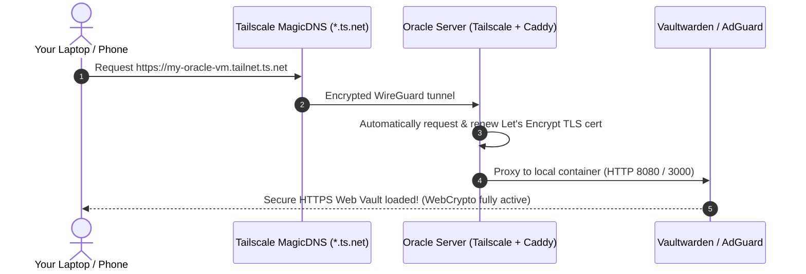

# Personal Cloud Hub: Vaultwarden, Tailscale & AdGuard Home (Zero Domain & SSL)

## Goal Description
Deploy a rock-solid, production-grade **Privacy & Cloud Hub** on your Oracle Cloud `VM.Standard.E2.1.Micro` server, focusing strictly on:
1. **Tailscale**: Encrypted WireGuard mesh network providing private zero-trust access.
2. **Vaultwarden**: Lightweight self-hosted Bitwarden password manager (<40MB RAM).
3. **AdGuard Home**: Network-wide ad/tracker blocker and encrypted DNS server (<50MB RAM).

The setup includes:
- **Zero-domain & Zero-SSL requirement**: Free, automated, trusted Let's Encrypt certificates generated via Tailscale MagicDNS (`*.ts.net`).
- **RAM & CPU Hardening**: Strict memory caps and kernel tuning tailored for the 1GB RAM AMD Micro VM.
- **Complete Rollback Plan**: Step-by-step and automated one-click teardown to return the server to 100% stock condition.

---

## How We Handle "No Domain & No SSL Cert"

> [!IMPORTANT]
> **The Problem with Vaultwarden & Plain HTTP**
> Modern web browsers (Chrome, Firefox, Safari, Edge) enforce the **WebCrypto API Security Standard**: they refuse to allow password encryption/decryption keys to be generated over plain `http://` (unless it is `localhost`). Therefore, Vaultwarden **requires HTTPS**.

### The Solution: Tailscale Automated MagicDNS & Free SSL (`*.ts.net`)
Tailscale provides free, officially trusted **Let's Encrypt SSL certificates** for your private machines with zero custom domain purchase needed:



1. Tailscale assigns your server a unique private domain (e.g. `oracle-node.your-tailnet.ts.net`).
2. When Tailscale HTTPS (or Caddy with Tailscale cert integration) is enabled, it automatically requests and renews a real, browser-trusted Let's Encrypt certificate for that domain.
3. You get a green padlock in your browser, full Bitwarden browser extension compatibility, and total isolation from the public internet.

---

## Best Practices Followed

1. **Least-Privilege & Network Isolation**:
   - Container ports (Vaultwarden `:8080`, AdGuard Web `:3000`) bind only to `127.0.0.1` (localhost) or the private Tailscale interface (`tailscale0`), never exposed to the raw public internet.
2. **Deterministic Memory Caps**:
   - Docker `mem_limit` and `memswap_limit` set on every service to prevent Out-Of-Memory (OOM) kernel panics on 1GB RAM.
3. **Log Rotation Enforcement**:
   - Docker daemon configured to cap container logs at 10MB x 3 files, preventing disk exhaustion over months of operation.
4. **Clean Ubuntu DNS Coexistence**:
   - Cleanly configure `systemd-resolved` so AdGuard Home can operate on port 53 without breaking local system DNS resolution.
5. **Secure Defaults**:
   - Admin token generation for Vaultwarden, with signups restricted once your master account is created.

---

## Proposed File & Directory Layout

```
/opt/homelab/
├── .env                          # Passwords, tokens, config keys (0600 permissions)
├── docker-compose.yml            # Vaultwarden & AdGuard Home containers
├── Caddyfile                     # Reverse proxy with MagicDNS TLS termination
├── scripts/
│   ├── install.sh                # Automated setup helper
│   └── rollback.sh               # Complete cleanup and teardown script
└── data/
    ├── vaultwarden/              # Password database (SQLite) and attachments
    ├── adguard/
    │   ├── conf/                 # AdGuard YAML configuration & filter rules
    │   └── work/                 # Query logs & stats
    └── caddy/                    # TLS certificates & data
```

---

## Step-by-Step Implementation Details

### Component 1: OS Baseline & DNS Stub Preparation
#### [NEW] `/etc/sysctl.d/99-homelab.conf`
```ini
vm.swappiness = 15
vm.vfs_cache_pressure = 50
net.ipv4.ip_forward = 1
net.ipv6.conf.all.forwarding = 1
```

#### [NEW] `/etc/systemd/resolved.conf.d/adguard.conf`
Configure `systemd-resolved` to disable port 53 stub listener on localhost so AdGuard Home can bind cleanly:
```ini
[Resolve]
DNS=1.1.1.1 8.8.8.8
DNSStubListener=no
```

---

### Component 2: Docker Engine & Compose Setup
#### [NEW] `/etc/docker/daemon.json`
```json
{
  "log-driver": "json-file",
  "log-opts": {
    "max-size": "10m",
    "max-file": "3"
  }
}
```

---

### Component 3: Tailscale Installation
Install official Tailscale package:
```bash
curl -fsSL https://pkgs.tailscale.com/stable/ubuntu/noble.noarmor.gpg | sudo tee /usr/share/keyrings/tailscale-archive-keyring.gpg >/dev/null
curl -fsSL https://pkgs.tailscale.com/stable/ubuntu/noble.tailscale-keyring.list | sudo tee /etc/apt/sources.list.d/tailscale.list
sudo apt-get update && sudo apt-get install -y tailscale
```

---

### Component 4: Stack Definition
#### [NEW] `/opt/homelab/docker-compose.yml`
```yaml
services:
  vaultwarden:
    image: vaultwarden/server:alpine
    container_name: vaultwarden
    restart: unless-stopped
    environment:
      - WEBSOCKET_ENABLED=true
      - SIGNUPS_ALLOWED=true
      - INVITATIONS_ALLOWED=false
      - LOG_FILE=/data/vaultwarden.log
      - EXTENDED_LOGGING=true
    volumes:
      - /opt/homelab/data/vaultwarden:/data
    networks:
      - homelab_net
    deploy:
      resources:
        limits:
          memory: 128M
          cpus: '0.75'

  adguardhome:
    image: adguard/adguardhome:latest
    container_name: adguardhome
    restart: unless-stopped
    ports:
      - "53:53/tcp"
      - "53:53/udp"
      - "127.0.0.1:3000:3000/tcp"  # Initial setup wizard
    volumes:
      - /opt/homelab/data/adguard/work:/opt/adguardhome/work
      - /opt/homelab/data/adguard/conf:/opt/adguardhome/conf
    networks:
      - homelab_net
    deploy:
      resources:
        limits:
          memory: 128M
          cpus: '0.75'

  caddy:
    image: caddy:alpine
    container_name: caddy
    restart: unless-stopped
    ports:
      - "80:80"
      - "443:443"
    volumes:
      - /opt/homelab/Caddyfile:/etc/caddy/Caddyfile:ro
      - /opt/homelab/data/caddy/data:/data
      - /opt/homelab/data/caddy/config:/config
      - /var/run/tailscale/tailscaled.sock:/var/run/tailscale/tailscaled.sock:ro
    networks:
      - homelab_net
    deploy:
      resources:
        limits:
          memory: 64M
          cpus: '0.50'

networks:
  homelab_net:
    driver: bridge
```

---

## The Rollback Plan (Complete Teardown & Cleanup)

If at any point you want to completely remove everything and restore your server to its pristine initial state, we provide both an automated script and manual commands.

### Automated Rollback Script
#### [NEW] `/opt/homelab/scripts/rollback.sh`
```bash
#!/usr/bin/env bash
set -euo pipefail

echo "==> Starting Complete Rollback & Cleanup <=="

# 1. Stop and remove all containers and networks
if command -v docker &>/dev/null && [ -f /opt/homelab/docker-compose.yml ]; then
    echo "--> Stopping and removing Docker containers..."
    docker compose -f /opt/homelab/docker-compose.yml down -v --remove-orphans || true
fi

# 2. Stop and purge Docker engine (if total removal requested)
echo "--> Removing Docker packages & repositories..."
sudo systemctl stop docker containerd 2>/dev/null || true
sudo apt-get purge -y docker-ce docker-ce-cli containerd.io docker-buildx-plugin docker-compose-plugin docker-ce-rootless-extras 2>/dev/null || true
sudo apt-get autoremove -y --purge
sudo rm -rf /var/lib/docker /var/lib/containerd /etc/docker /etc/apt/keyrings/docker.gpg /etc/apt/sources.list.d/docker.list

# 3. Stop and purge Tailscale
echo "--> Disconnecting and removing Tailscale..."
sudo tailscale down 2>/dev/null || true
sudo systemctl stop tailscaled 2>/dev/null || true
sudo apt-get purge -y tailscale 2>/dev/null || true
sudo rm -rf /var/lib/tailscale /usr/share/keyrings/tailscale-archive-keyring.gpg /etc/apt/sources.list.d/tailscale.list

# 4. Restore systemd-resolved and DNS stub listener
echo "--> Restoring systemd-resolved settings..."
sudo rm -f /etc/systemd/resolved.conf.d/adguard.conf
sudo ln -sf /run/systemd/resolve/stub-resolv.conf /etc/resolv.conf
sudo systemctl restart systemd-resolved

# 5. Remove sysctl optimizations
echo "--> Restoring kernel sysctl defaults..."
sudo rm -f /etc/sysctl.d/99-homelab.conf
sudo sysctl --system

# 6. Delete all homelab directories and data
echo "--> Deleting /opt/homelab directory..."
sudo rm -rf /opt/homelab

echo "==> Rollback complete! Server restored to pristine baseline state. <=="
```

---

## Verification Plan

### Automated Tests
1. **Memory & Swappiness verification**:
   `sysctl vm.swappiness` (verifies `15`) and `free -h`
2. **Port 53 & Resolver verification**:
   `sudo ss -tulpn | grep ':53'` (verifies AdGuard bound cleanly)
3. **Container Health & Resource check**:
   `docker compose -f /opt/homelab/docker-compose.yml ps`
   `docker stats --no-stream` (verifies total RAM < 250MB)
4. **Tailscale Daemon Status**:
   `tailscale status`

### Manual Verification
1. **Tailscale Connection**:
   Authenticate the server using the provided one-click login link.
2. **Vaultwarden HTTPS Access**:
   Access `https://<tailscale-hostname>` from your browser on your phone/laptop connected to Tailscale. Confirm green padlock and create a test vault account.
3. **AdGuard Home Dashboard**:
   Access `http://<tailscale-ip>:3000` to complete setup, set admin credentials, and verify query blocking in the statistics tab.
