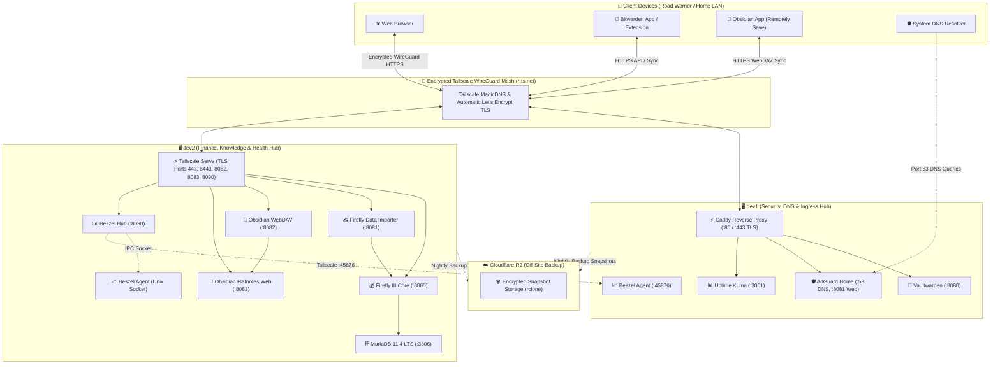

# 🏠 Homelab Knowledge Hub & Architecture

> [!NOTE]
> Welcome to the **Personal Cloud & Multi-Host Homelab Knowledge Base**. This vault is structured following Obsidian best practices to provide complete architectural blueprints, service documentation, operations manuals, and disaster recovery runbooks, compatible with both **Obsidian** and **Flatnotes**.

---

## ⚡ Quick Access Service Directory

| Service | Host | Port | Ingress Method | Access URL | Category | Status |
| :--- | :--- | :--- | :--- | :--- | :--- | :--- |
| [[02 - Service - Vaultwarden\|Vaultwarden]] | `dev1` | `:8080` | Caddy (`:443`) | `https://dev1.<tailnet>.ts.net` | Security | 🟢 Active |
| [[02 - Service - AdGuard Home\|AdGuard Home]] | `dev1` | `:8081` | Caddy (`:8081`) | `https://dev1.<tailnet>.ts.net:8081` | Network / DNS | 🟢 Active |
| [[02 - Service - AdGuard Home\|AdGuard DNS]] | `dev1` | `:53` | Tailscale IP | `<dev1-tailscale-ip>:53` | Network / DNS | 🟢 Active |
| [[02 - Service - Uptime Kuma\|Uptime Kuma]] | `dev1` | `:3001` | Caddy (`:3001`) | `https://dev1.<tailnet>.ts.net:3001` | Monitoring | 🟢 Active |
| [[02 - Service - Beszel Server Monitoring\|Beszel Agent]] | `dev1` | `:45876`| Host Mode | `dev1.<tailnet>.ts.net:45876` | Monitoring | 🟢 Active |
| [[02 - Service - Firefly III Core\|Firefly III Core]] | `dev2` | `:8080` | Tailscale Serve | `https://dev2.<tailnet>.ts.net` | Finance | 🟢 Active |
| [[02 - Service - Firefly III Data Importer\|Firefly Importer]] | `dev2` | `:8081` | Tailscale Serve | `https://dev2.<tailnet>.ts.net:8443` | Finance | 🟢 Active |
| [[02 - Service - Obsidian Sync & Flatnotes\|Obsidian WebDAV]] | `dev2` | `:8082` | Tailscale Serve | `https://dev2.<tailnet>.ts.net:8082/data/` | Knowledge | 🟢 Active |
| [[02 - Service - Obsidian Sync & Flatnotes\|Flatnotes Web]] | `dev2` | `:8083` | Tailscale Serve | `https://dev2.<tailnet>.ts.net:8083` | Knowledge | 🟢 Active |
| [[02 - Service - Beszel Server Monitoring\|Beszel Hub]] | `dev2` | `:8090` | Tailscale Serve | `https://dev2.<tailnet>.ts.net:8090` | Monitoring | 🟢 Active |
| [[02 - Service - Beszel Server Monitoring\|Beszel Agent]] | `dev2` | Socket | Unix Socket | `/beszel_socket/beszel.sock` | Monitoring | 🟢 Active |

---

## 🗺️ Multi-Host Infrastructure Topology

---

## 🗂️ Knowledge Base Sections

### 📐 01 - Architecture & Infrastructure
- [[01 - Architecture - Homelab Topology|01 - Architecture - Homelab Topology]]
- [[01 - Architecture - Host Nodes & Specifications|01 - Architecture - Host Nodes & Specifications]]
- [[01 - Architecture - Network & Tailscale Mesh|01 - Architecture - Network & Tailscale Mesh]]
- [[01 - Architecture - Ingress & Caddy Reverse Proxy|01 - Architecture - Ingress & Caddy Reverse Proxy]]
- [[01 - Architecture - Security Model & Threat Isolation|01 - Architecture - Security Model & Threat Isolation]]

### 📦 02 - Core Services Directory
- [[02 - Service - Vaultwarden|02 - Service - Vaultwarden (Passwords)]]
- [[02 - Service - AdGuard Home|02 - Service - AdGuard Home (DNS & Ad-Blocking)]]
- [[02 - Service - Uptime Kuma|02 - Service - Uptime Kuma (Uptime & SSL Alerts)]]
- [[02 - Service - Firefly III Core|02 - Service - Firefly III Core (Accounting)]]
- [[02 - Service - Firefly III Data Importer|02 - Service - Firefly III Data Importer (Bank Imports)]]
- [[02 - Service - Obsidian Sync & Flatnotes|02 - Service - Obsidian Sync & Flatnotes (Knowledge Base)]]
- [[02 - Service - Beszel Server Monitoring|02 - Service - Beszel Server Monitoring (Telemetry)]]
- [[02 - Service - Caddy Reverse Proxy|02 - Service - Caddy Reverse Proxy (TLS Ingress)]]
- [[02 - Service - Tailscale WireGuard Mesh|02 - Service - Tailscale WireGuard Mesh (VPN)]]

### 🛠️ 03 - Operations & Setup Guides
- [[03 - Guide - Operations, Maintenance & Troubleshooting|03 - Guide - Operations, Maintenance & Troubleshooting]]
- [[03 - Guide - Notifications & Alerting (Telegram, Pushover, Email)|03 - Guide - Notifications & Alerting (Telegram & Pushover)]]
- [[03 - Guide - Obsidian Multi-Device Setup & Remotely Save|03 - Guide - Obsidian Multi-Device Setup & Remotely Save]]
- [[03 - Guide - Beszel Multi-Node Monitoring Setup|03 - Guide - Beszel Multi-Node Monitoring Setup]]

### 🚑 04 - Disaster Recovery & Backups
- [[04 - Disaster Recovery - Backup & Off-Site Sync (Cloudflare R2)|04 - Disaster Recovery - Backup & Off-Site Sync]]
- [[04 - Disaster Recovery - Disaster Recovery & Restore|04 - Disaster Recovery - Disaster Recovery & Restore]]
- [[04 - Disaster Recovery - Runbook dev1|04 - Disaster Recovery - Runbook dev1]]
- [[04 - Disaster Recovery - Runbook dev2|04 - Disaster Recovery - Runbook dev2]]
- [[04 - Disaster Recovery - Verification & Live Testing|04 - Disaster Recovery - Verification & Live Testing]]

### 📝 Reusable Note Templates
- [[Template - Service Note|Template - Service Note]]
- [[Template - Operational Guide|Template - Operational Guide]]
- [[Template - Disaster Recovery Runbook|Template - Disaster Recovery Runbook]]
- [[Template - Architecture Spec|Template - Architecture Spec]]

---

## 🏷️ Tag Index

- **Type**: `#homelab/moc`, `#homelab/service`, `#homelab/guide`, `#homelab/runbook`, `#homelab/architecture`, `#homelab/template`
- **Host**: `#host/dev1`, `#host/dev2`, `#host/multi-host`, `#host/client`
- **Category**: `#category/security`, `#category/networking`, `#category/finance`, `#category/monitoring`, `#category/knowledge`, `#category/backup`, `#category/dr`, `#category/operations`
- **Status**: `#status/active`, `#status/maintenance`, `#status/testing`
