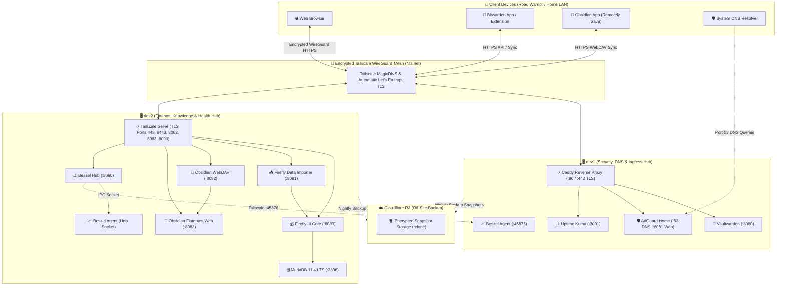

# 🏠 Homelab Knowledge Hub & Architecture

> [!NOTE]
> Welcome to the **Personal Cloud & Multi-Host Homelab Knowledge Base**. This vault is structured following Obsidian best practices to provide complete architectural blueprints, service documentation, operations manuals, and disaster recovery runbooks.

---

## ⚡ Quick Access Service Directory

| Service | Host | Port | Ingress Method | Access URL | Category | Status |
| :--- | :--- | :--- | :--- | :--- | :--- | :--- |
| [[Service - Vaultwarden\|Vaultwarden]] | `dev1` | `:8080` | Caddy (`:443`) | `https://dev1.<tailnet>.ts.net` | Security | 🟢 Active |
| [[Service - AdGuard Home\|AdGuard Home]] | `dev1` | `:8081` | Caddy (`:8081`) | `https://dev1.<tailnet>.ts.net:8081` | Network / DNS | 🟢 Active |
| [[Service - AdGuard Home\|AdGuard DNS]] | `dev1` | `:53` | Tailscale IP | `<dev1-tailscale-ip>:53` | Network / DNS | 🟢 Active |
| [[Service - Uptime Kuma\|Uptime Kuma]] | `dev1` | `:3001` | Caddy (`:3001`) | `https://dev1.<tailnet>.ts.net:3001` | Monitoring | 🟢 Active |
| [[Service - Beszel Server Monitoring\|Beszel Agent]] | `dev1` | `:45876`| Host Mode | `dev1.<tailnet>.ts.net:45876` | Monitoring | 🟢 Active |
| [[Service - Firefly III Core\|Firefly III Core]] | `dev2` | `:8080` | Tailscale Serve | `https://dev2.<tailnet>.ts.net` | Finance | 🟢 Active |
| [[Service - Firefly III Data Importer\|Firefly Importer]] | `dev2` | `:8081` | Tailscale Serve | `https://dev2.<tailnet>.ts.net:8443` | Finance | 🟢 Active |
| [[Service - Obsidian Sync & Flatnotes\|Obsidian WebDAV]] | `dev2` | `:8082` | Tailscale Serve | `https://dev2.<tailnet>.ts.net:8082/data/` | Knowledge | 🟢 Active |
| [[Service - Obsidian Sync & Flatnotes\|Flatnotes Web]] | `dev2` | `:8083` | Tailscale Serve | `https://dev2.<tailnet>.ts.net:8083` | Knowledge | 🟢 Active |
| [[Service - Beszel Server Monitoring\|Beszel Hub]] | `dev2` | `:8090` | Tailscale Serve | `https://dev2.<tailnet>.ts.net:8090` | Monitoring | 🟢 Active |
| [[Service - Beszel Server Monitoring\|Beszel Agent]] | `dev2` | Socket | Unix Socket | `/beszel_socket/beszel.sock` | Monitoring | 🟢 Active |

---

## 🗺️ Multi-Host Infrastructure Topology



---

## 🗂️ Knowledge Base Navigation

### 1. [[00 - Architecture MOC|📐 01 - Architecture & Infrastructure]]
Comprehensive system design, networking, reverse proxies, and threat model:
- [[Homelab Architecture & Topology|Homelab Architecture & Topology Overview]]
- [[Host Nodes & Server Specifications|Host Nodes & Server Hardware Specs]]
- [[Network & Tailscale WireGuard Mesh|Tailscale WireGuard Mesh & MagicDNS]]
- [[Ingress & Caddy Reverse Proxy|Caddy Reverse Proxy & Automatic TLS]]
- [[Security Model & Threat Isolation|Zero-Trust Security & Network Isolation]]

### 2. [[00 - Services MOC|📦 02 - Core Services Directory]]
Deep technical specifications, configuration files, and maintenance steps:
- [[Service - Vaultwarden|Vaultwarden (Self-Hosted Password Vault)]]
- [[Service - AdGuard Home|AdGuard Home (Network-Wide DNS & Ad Sinkhole)]]
- [[Service - Uptime Kuma|Uptime Kuma (Uptime, SSL & Incident Monitor)]]
- [[Service - Firefly III Core|Firefly III Core (Double-Entry Personal Accounting)]]
- [[Service - Firefly III Data Importer|Firefly III Data Importer (Automated Bank Importer)]]
- [[Service - Obsidian Sync & Flatnotes|Obsidian Tri-Platform Sync & Flatnotes Web Wiki]]
- [[Service - Beszel Server Monitoring|Beszel (Server Telemetry & Resource Hub)]]

### 3. [[00 - Operations MOC|🛠️ 03 - Operations & Setup Guides]]
Daily operations, alerting, maintenance checklists, and client setups:
- [[Guide - Operations, Maintenance & Troubleshooting|Operations, Maintenance & Troubleshooting Guide]]
- [[Guide - Notifications & Alerting (Telegram, Pushover, Email)|Multi-Tier Alerting Guide (Telegram & Pushover)]]
- [[Guide - Obsidian Multi-Device Setup & Remotely Save|Obsidian Client Setup & Remotely Save WebDAV]]
- [[Guide - Beszel Multi-Node Monitoring Setup|Beszel Multi-Node Agent Setup Guide]]

### 4. [[00 - Disaster Recovery MOC|🚑 04 - Disaster Recovery & Backups]]
3-2-1 backup strategy, bare-metal recovery runbooks, and validation tests:
- [[Guide - Backup & Off-Site Sync (Cloudflare R2)|Automated Backups & Cloudflare R2 Sync Guide]]
- [[Guide - Disaster Recovery & Bare-Metal Restore|Disaster Recovery Architecture & Restore Guide]]
- [[Disaster Recovery Runbook - dev1|Dedicated Disaster Recovery Runbook: dev1]]
- [[Disaster Recovery Runbook - dev2|Dedicated Disaster Recovery Runbook: dev2]]
- [[Disaster Recovery Verification & Live Testing|Disaster Recovery Live Verification & Testing Protocol]]

---

## 🏷️ Tag Index

- **Type**: `#homelab/moc`, `#homelab/service`, `#homelab/guide`, `#homelab/runbook`, `#homelab/architecture`, `#homelab/template`
- **Host**: `#host/dev1`, `#host/dev2`, `#host/multi-host`, `#host/client`
- **Category**: `#category/security`, `#category/networking`, `#category/finance`, `#category/monitoring`, `#category/knowledge`, `#category/backup`, `#category/dr`, `#category/operations`
- **Status**: `#status/active`, `#status/maintenance`, `#status/testing`

---

## 🔗 Quick Actions & Operational Scripts

```bash
# 1. Run Complete Diagnostic Health Check
sudo bash /opt/homelab/scripts/healthcheck.sh

# 2. Run Point-in-Time Snapshot Backup
sudo bash /opt/homelab/scripts/backup_homelab.sh

# 3. Synchronize Notes to Live Obsidian & Flatnotes Vault
sudo bash /opt/homelab/scripts/sync_notes_to_vault.sh

# 4. Perform Disaster Recovery Restoration
sudo bash /opt/homelab/scripts/restore_homelab.sh --latest
```
