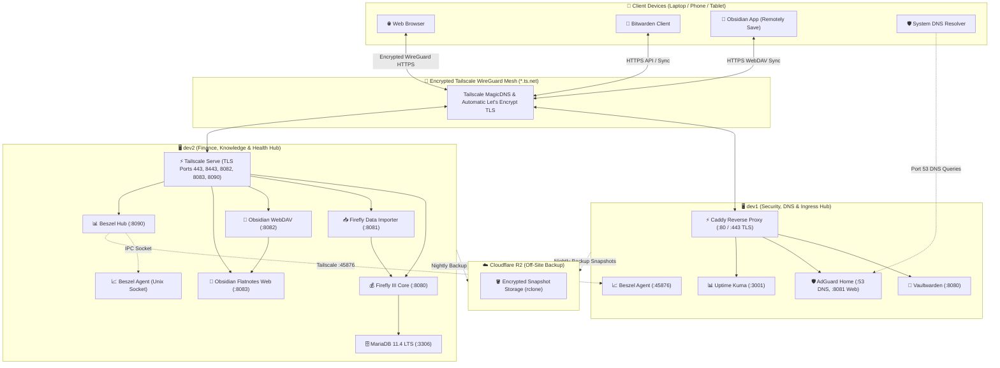

# 🏠 Homelab Overview & Architecture

Welcome to the **Personal Cloud & Homelab Knowledge Base**. This documentation hub provides complete architectural specifications, service guides, deployment workflows, backup strategies, and disaster recovery runbooks across your homelab infrastructure.

---

## 🌐 Topology & Architecture

The homelab is designed as a distributed, high-security, ultra-lightweight multi-node infrastructure running on Ubuntu LTS with zero public internet exposure.

---

## 🏛️ Host Node Roles & Specifications

### Host: `dev1` (Identity, DNS Sinkhole & Service Monitoring)
- **Primary Role:** Edge security, network-wide ad & tracker blocking, password vault, uptime monitoring.
- **TLS Termination:** Native Caddy Reverse Proxy utilizing Tailscale Let's Encrypt certificates (`tls { get_certificate tailscale }`).
- **Memory Footprint:** ~30–50 MB total idle RAM.

### Host: `dev2` (Finance, Knowledge Base & Server Health Hub)
- **Primary Role:** Double-entry accounting, Obsidian markdown sync backend, Flatnotes web wiki, central Beszel resource telemetry.
- **TLS Termination:** Native Tailscale Serve (`tailscale serve --bg --https=<port> <target>`).
- **Memory Footprint:** ~130–150 MB total idle RAM across seven containers, strictly tuned for 1 GB RAM servers.

---

## 📋 Comprehensive Service Directory

| Service | Host | Internal Port | Ingress Method | Tailscale Access URL | Primary Purpose |
| :--- | :--- | :--- | :--- | :--- | :--- |
| **Vaultwarden** | `dev1` | `127.0.0.1:8080` | Caddy (:443) | `https://dev1.<tailnet>.ts.net` | Self-hosted Bitwarden password manager |
| **AdGuard Home** | `dev1` | `127.0.0.1:8081` | Caddy (:8081) | `https://dev1.<tailnet>.ts.net:8081` | Ad-blocking & local DNS resolver |
| **AdGuard DNS** | `dev1` | `0.0.0.0:53` | Tailscale IP | `<dev1-tailscale-ip>:53` (Tailnet DNS) | Network-wide WireGuard DNS sinkhole |
| **Uptime Kuma** | `dev1` | `127.0.0.1:3001` | Caddy (:3001) | `https://dev1.<tailnet>.ts.net:3001` | Service uptime & SSL monitor |
| **Beszel Agent** | `dev1` | `0.0.0.0:45876` | Host Port | Tailscale Mesh Port `45876` | Metrics collector for dev1 |
| **Firefly III** | `dev2` | `127.0.0.1:8080` | Tailscale Serve | `https://dev2.<tailnet>.ts.net` | Personal finance & bookkeeping |
| **Firefly Importer**| `dev2` | `127.0.0.1:8081` | Tailscale Serve | `https://dev2.<tailnet>.ts.net:8443` | Bank CSV/CAMT statement importer |
| **Obsidian WebDAV** | `dev2` | `127.0.0.1:8082` | Tailscale Serve | `https://dev2.<tailnet>.ts.net:8082/data/` | Remotely Save sync endpoint |
| **Flatnotes Web** | `dev2` | `127.0.0.1:8083` | Tailscale Serve | `https://dev2.<tailnet>.ts.net:8083` | Web markdown wiki & note editor |
| **Beszel Hub** | `dev2` | `127.0.0.1:8090` | Tailscale Serve | `https://dev2.<tailnet>.ts.net:8090` | Central server health metrics dashboard |
| **Beszel Agent** | `dev2` | Unix Socket | IPC Socket | `/beszel_socket/beszel.sock` | Local telemetry collector for dev2 |
| **MariaDB 11.4** | `dev2` | `3306` (Docker) | Internal | N/A (Docker bridge only) | Firefly III relational database |

---

## 🔒 Security Principles

1. **Zero Public Internet Exposure:** No ports (80, 443, 53, etc.) are forwarded or opened on public WAN firewalls. All incoming connections require authenticated WireGuard tunnel membership.
2. **Encrypted WireGuard Mesh:** Node-to-node and client-to-node communication is end-to-end encrypted using modern ChaCha20-Poly1305 ciphers.
3. **Automated Trusted TLS:** Free, automated Let's Encrypt certificates managed directly by Tailscale MagicDNS.
4. **Least Privilege & Local Binding:** All container ports bind strictly to `127.0.0.1` or internal Docker networks.
5. **Point-in-Time Non-Blocking Backups:** Automated daily snapshots with SQLite hot backup and MariaDB single-transaction dumps, encrypted offsite sync to Cloudflare R2.
6. **Hard Resource Capping:** Every container enforces memory and CPU limits to prevent Out-Of-Memory (OOM) kernel crashes.

---

## 📚 Knowledge Base Navigation

- [[Service - Vaultwarden|Vaultwarden Setup & Client Guide]]
- [[Service - AdGuard Home|AdGuard Home DNS & Blocklist Guide]]
- [[Service - Uptime Kuma|Uptime Kuma Monitors & Alerts Guide]]
- [[Service - Caddy Reverse Proxy|Caddy Reverse Proxy & TLS Guide]]
- [[Service - Tailscale WireGuard Mesh|Tailscale Mesh & MagicDNS Guide]]
- [[Service - Firefly III Core|Firefly III Personal Finance Guide]]
- [[Service - Firefly III Data Importer|Firefly III Statement Importer Guide]]
- [[Service - Obsidian Sync & Flatnotes|Obsidian Tri-Platform Sync & Flatnotes Guide]]
- [[Service - Beszel Server Monitoring|Beszel Health Dashboard & Agent Guide]]
- [[Guide - Backup & Off-Site Sync|Automated Backup & Cloudflare R2 Sync Guide]]
- [[Guide - Disaster Recovery & Restore|Disaster Recovery & Bare-Metal Restore Guide]]
- [[Guide - Operations, Maintenance & Troubleshooting|Operations, Monitoring & Maintenance Guide]]
