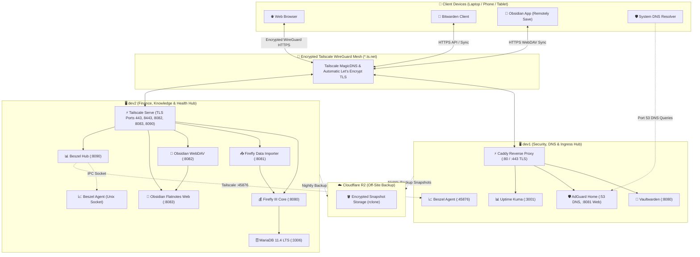

> 🧭 **Navigation**: [[00 - Homelab Hub|🏠 Homelab Hub]] ➔ [[00 - Architecture MOC|📐 Architecture]] ➔ **Homelab Architecture & Topology**

# 🗺️ Homelab Architecture & Topology

This document details the multi-node infrastructure topology, communication flows between client devices and servers, and service mapping across nodes.

---

## 🏗️ Multi-Host Structural Design

The homelab distributes services across two distinct Ubuntu hosts to balance workload, isolate critical security functions, and stay well within memory constraints (designed for 1 GB RAM nodes):

1. **`dev1` (Edge Security, Ingress & DNS)**:
   - Hosts authentication (Vaultwarden), DNS ad-blocking (AdGuard Home), and active uptime probing (Uptime Kuma).
   - Serves as the primary ingress point using Caddy Reverse Proxy.
2. **`dev2` (Finance, Knowledge Base & System Health Hub)**:
   - Hosts personal finance bookkeeping (Firefly III & Importer with MariaDB).
   - Hosts the Obsidian sync backend (WebDAV) and browser wiki (Flatnotes).
   - Hosts the central Beszel health monitoring telemetry hub.

---

## 📊 End-to-End System Topology Diagram

---

## 🔒 Key Design Tenets

1. **Zero Open Public Ports**: No ports are open to the public Internet. WAN ingress is 100% blocked.
2. **Encrypted Transport Layer**: All traffic flows through WireGuard tunnels with ChaCha20-Poly1305 authenticated encryption.
3. **Automated Trusted TLS**: Real Let's Encrypt certificates managed automatically via Tailscale MagicDNS.
4. **Hard Memory Caps**: Every container enforces CPU and memory limits to prevent out-of-memory kernel panics.

---

## 🔗 Related Notes & Runbooks
- [[Host Nodes & Server Specifications|Host Nodes Specifications]]
- [[Network & Tailscale WireGuard Mesh|Tailscale Mesh Networking]]
- [[00 - Services MOC|Core Services Directory]]
- [[Guide - Backup & Off-Site Sync (Cloudflare R2)|Backup Strategy]]
