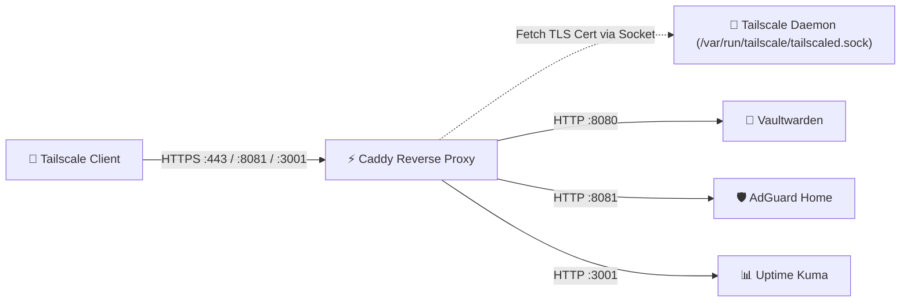

> 🧭 **Navigation**: [[00 - Homelab Hub|🏠 Homelab Hub]] ➔ [[00 - Architecture MOC|📐 Architecture]] ➔ **Ingress & Caddy Reverse Proxy**

# ⚡ Ingress & Caddy Reverse Proxy

**Caddy** serves as the primary ingress controller and automatic TLS termination engine on `dev1`. It bridges incoming HTTPS requests from the encrypted Tailscale mesh to internal container services.

---

## 🏗️ Architecture & Unix Socket Integration

Caddy interacts with Tailscale via the local daemon socket:
- **Socket Path:** `/var/run/tailscale/tailscaled.sock`
- **Certificate Source:** Caddy requests Let's Encrypt certificates directly from Tailscale using `tls { get_certificate tailscale }`.
- **Zero DNS Tokens Needed:** Tailscale handles ACME domain validation natively through MagicDNS.



---

## 📋 Active Caddyfile Configuration

```caddyfile
# Global Options
{
    admin off
    auto_https off
}

# 1. Vaultwarden (Bitwarden API & Web Vault)
{$TAILSCALE_FQDN}:443 {
    tls {
        get_certificate tailscale
    }
    encode gzip
    reverse_proxy 127.0.0.1:8080 {
        header_up X-Real-IP {remote_host}
        header_up X-Forwarded-Proto {scheme}
    }
}

# 2. AdGuard Home Admin Web UI
{$TAILSCALE_FQDN}:8081 {
    tls {
        get_certificate tailscale
    }
    reverse_proxy 127.0.0.1:8081
}

# 3. Uptime Kuma Dashboard
{$TAILSCALE_FQDN}:3001 {
    tls {
        get_certificate tailscale
    }
    reverse_proxy 127.0.0.1:3001
}
```

---

## 🔗 Related Notes
- [[Service - Caddy Reverse Proxy|Caddy Service Documentation]]
- [[Network & Tailscale WireGuard Mesh|Tailscale Mesh Networking]]
- [[Service - Vaultwarden|Vaultwarden Password Vault]]
