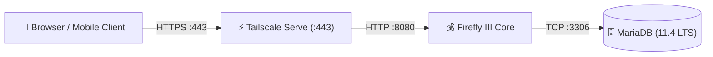

> 🧭 **Navigation**: [[00 - Homelab Hub|🏠 Homelab Hub]] ➔ [[00 - Services MOC|📦 Services]] ➔ **Firefly III Core**

# 💰 Service: Firefly III Core (Personal Finance & Accounting)

**Firefly III** is a self-hosted personal finance manager designed around double-entry bookkeeping principles. It allows tracking income, expenses, budgets, savings goals, recurring bills, and multi-currency assets without sharing banking credentials with third-party aggregators.

---

## 🏗️ Architecture & Deployment

- **Host Node:** `dev2`
- **Application Image:** `fireflyiii/core:latest`
- **Database Image:** `mariadb:lts` (MariaDB 11.4 LTS)
- **Local Application Port:** `127.0.0.1:8080`
- **Tailscale Ingress URL:** `https://dev2.<tailnet>.ts.net` (via Tailscale Serve on port 443)
- **Data Storage:**
  - Database data: `/opt/homelab/data/dev2/firefly/db`
  - Uploaded receipts/attachments: `/opt/homelab/data/dev2/firefly/upload`
- **Resource Constraints (1GB RAM Optimization):**
  - `firefly_app`: Max 384 MB RAM, 1.0 vCPU
  - `firefly_db`: Max 256 MB RAM, 0.75 vCPU
  - MariaDB tuning command: `--innodb-buffer-pool-size=128M --performance_schema=OFF --max-connections=50`

---

## ⚙️ Mobile Client & API Integration

Firefly III supports the open-source **Waterfly III** mobile app for Android:
1. In Firefly III web UI, navigate to **Profile ➔ OAuth ➔ Personal Access Tokens**.
2. Click **Create New Token** and name it `Waterfly Mobile`.
3. Open Waterfly III on your mobile device, enter:
   - Server URL: `https://dev2.<tailnet>.ts.net`
   - Personal Access Token: `<Generated-Token>`

---

## 💾 Backup & Point-in-Time Recovery

- **Live Database Dump:** Captured atomically via `mariadb-dump -u firefly -p --single-transaction --quick firefly`.
- **Receipts & Uploads:** Archived from `/opt/homelab/data/dev2/firefly/upload`.
- **Runbook:** [[Disaster Recovery Runbook - dev2|dev2 Disaster Recovery Runbook]]

---

## 🔗 Related Notes
- [[Service - Firefly III Data Importer|Firefly III Data Importer]]
- [[Guide - Backup & Off-Site Sync (Cloudflare R2)|Backup & Sync Guide]]
- [[Disaster Recovery Runbook - dev2|Disaster Recovery Runbook: dev2]]
