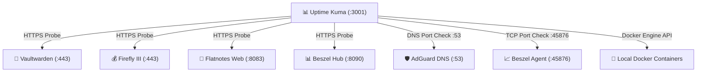

> 🧭 **Navigation**: [[00 - Homelab Hub|🏠 Homelab Hub]] ➔ [[00 - Services MOC|📦 Services]] ➔ **Uptime Kuma**

# 📊 Service: Uptime Kuma (Monitoring & Alerting Hub)

**Uptime Kuma** is a self-hosted monitoring tool that tracks uptime, response latency, certificate expiration, and health across all homelab services, delivering real-time alerts via Telegram, Pushover, and Email.

---

## 🏗️ Architecture & Deployment

- **Host Node:** `dev1`
- **Docker Image:** `louislam/uptime-kuma:1`
- **Internal Port:** `127.0.0.1:3001`
- **Ingress URL:** `https://dev1.<tailnet>.ts.net:3001` (via Caddy)
- **Database:** Embedded SQLite database (`/opt/homelab/data/uptime-kuma/kuma.db`)
- **Docker Socket Mount:** `/var/run/docker.sock:ro` (enables Docker container status monitoring)
- **Resource Constraints:** Max 128 MB RAM, 0.50 vCPU

---

## 🔔 Configured Active Probes

| Monitor Name | Type | Target Endpoint | Interval |
| :--- | :--- | :--- | :--- |
| **Vaultwarden HTTPS** | HTTP(s) | `https://dev1.<tailnet>.ts.net/alive` | 60s |
| **AdGuard Home Web** | HTTP(s) | `https://dev1.<tailnet>.ts.net:8081/login.html` | 60s |
| **AdGuard DNS Port 53**| Port (TCP/UDP) | `<dev1-tailscale-ip>:53` | 60s |
| **Firefly III HTTPS** | HTTP(s) | `https://dev2.<tailnet>.ts.net/` | 60s |
| **Obsidian WebDAV** | HTTP(s) | `https://dev2.<tailnet>.ts.net:8082/data/` | 60s |
| **Flatnotes Web** | HTTP(s) | `https://dev2.<tailnet>.ts.net:8083/` | 60s |
| **Beszel Hub HTTPS** | HTTP(s) | `https://dev2.<tailnet>.ts.net:8090/` | 60s |
| **Beszel Agent Port** | Port (TCP) | `dev1.<tailnet>.ts.net:45876` | 60s |

---

## 💾 Backup & Alerting Reference

- **Alert Configuration Guide:** [[Guide - Notifications & Alerting (Telegram, Pushover, Email)|Multi-Tier Alerting Guide]]
- **Database Backup:** Live snapshot of `kuma.db` via `scripts/backup_homelab.sh --host dev1`.

---

## 🔗 Related Notes
- [[Guide - Notifications & Alerting (Telegram, Pushover, Email)|Telegram Alerting Guide]]
- [[Service - Beszel Server Monitoring|Beszel Server Monitoring]]
- [[Disaster Recovery Runbook - dev1|dev1 Disaster Recovery Runbook]]
