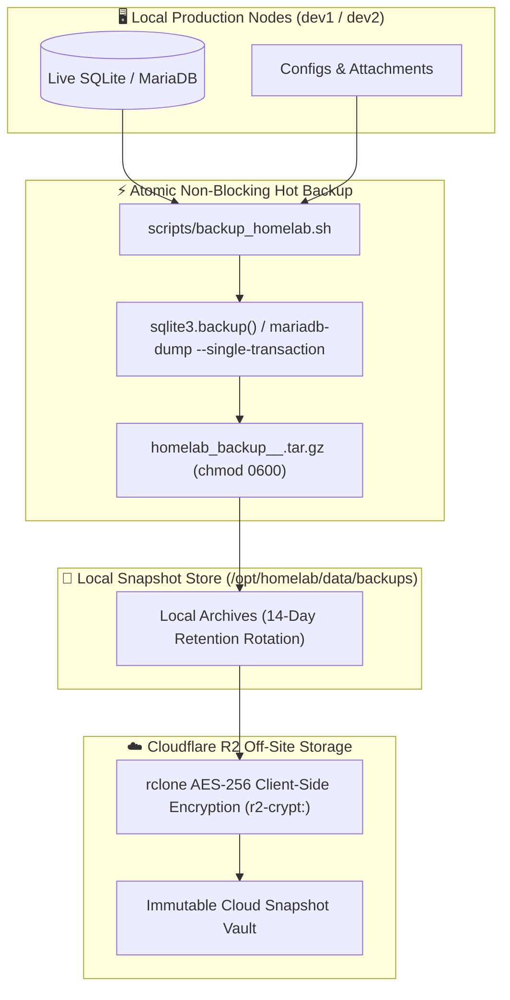

> 🧭 **Navigation**: [[00 - Homelab Hub|🏠 Homelab Hub]] ➔ [[00 - Disaster Recovery MOC|🚑 Disaster Recovery]] ➔ **Backup & Off-Site Sync**

# 💾 Guide: Automated Backups & Cloudflare R2 Off-Site Sync

This guide details the homelab's multi-host, zero-downtime automated backup architecture, retention policies, and off-site cloud replication workflows.

---

## 🎯 3-2-1 Backup Strategy

Our homelab adheres to the enterprise **3-2-1 Backup Principle**:
- **3 Copies of Data:** Production data, local timestamped snapshots, and off-site cloud archives.
- **2 Different Storage Media:** Local NVMe/SSD storage and Cloudflare R2 Object Storage.
- **1 Off-Site Copy:** Geographically redundant, immutable cloud bucket at Cloudflare R2.



---

## ⚡ What Gets Backed Up on Each Host

### On `dev1` (Identity, DNS & Edge Services):
- [x] **Vaultwarden:** Live SQLite hot snapshot (`db.sqlite3`), `rsa_key.pem`, and `config.json`.
- [x] **AdGuard Home:** Full YAML configuration (`AdGuardHome.yaml`) and custom filter rules.
- [x] **Uptime Kuma:** Live SQLite snapshot (`kuma.db`) with all notification integrations.
- [x] **Caddy Proxy:** `Caddyfile` and TLS configuration state.
- [x] **Environment:** Stack `.env` secrets locked at `0600`.

### On `dev2` (Finance & Monitoring):
- [x] **Firefly III Database:** Complete MariaDB logical dump (`mariadb-dump --single-transaction`).
- [x] **Firefly III Uploads:** All stored receipts, invoices, and attachments (`upload/`).
- [x] **Firefly Importer:** Import staging directory and configurations (`import/`).
- [x] **Obsidian Vault:** All Markdown notes, attachments, and Flatnotes search indexes.
- [x] **Beszel Hub:** Time-series SQLite database (`data.db`) and Ed25519 cryptographic keys.
- [x] **Environment:** Host `.env` secrets locked at `0600`.

---

## 🛠️ Automated Backup Execution

```bash
# Run backup manually on current host:
sudo bash /opt/homelab/scripts/backup_homelab.sh

# Run backup explicitly targeting dev2:
sudo bash /opt/homelab/scripts/backup_homelab.sh --host dev2
```

---

## 🔗 Related Notes
- [[Guide - Disaster Recovery & Bare-Metal Restore|Disaster Recovery Guide]]
- [[Disaster Recovery Runbook - dev1|Disaster Recovery Runbook: dev1]]
- [[Disaster Recovery Runbook - dev2|Disaster Recovery Runbook: dev2]]
