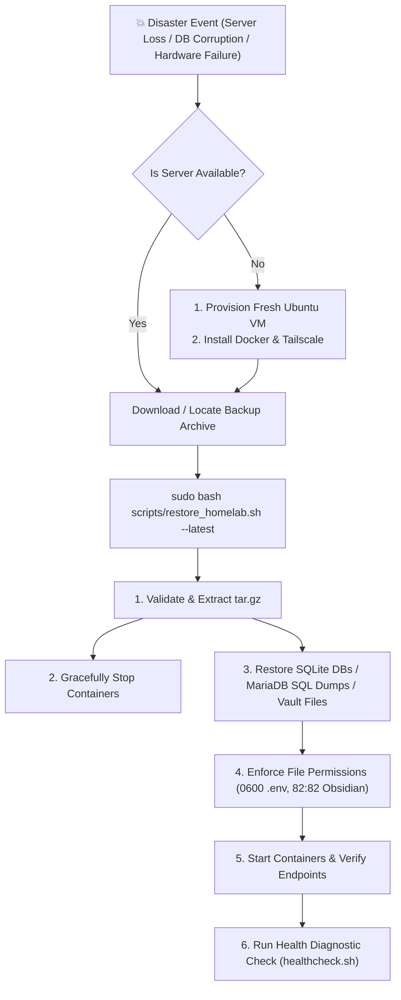

> 🧭 **Navigation**: [[00 - Homelab Hub|🏠 Homelab Hub]] ➔ [[00 - Disaster Recovery MOC|🚑 Disaster Recovery]] ➔ **Disaster Recovery & Restore**

# 🚑 Guide: Disaster Recovery & Complete Server Restoration

This runbook outlines step-by-step disaster recovery procedures for restoring individual corrupted services or performing complete bare-metal recovery from local snapshots or Cloudflare R2 cloud backups.

---

## 🎯 Recovery Objectives

- **Recovery Time Objective (RTO):** < 5 minutes (from snapshot archive to fully operational service stack).
- **Recovery Point Objective (RPO):** < 24 hours (nightly automated snapshots).



---

## ⚡ 1-Command Automated Restoration

The recovery script detects the host, extracts the snapshot, stops running containers gracefully, restores database states, resets proper file permissions, and brings the stack back online:

```bash
# Restore latest local backup:
sudo bash /opt/homelab/scripts/restore_homelab.sh --latest

# Restore from a specific archive:
sudo bash /opt/homelab/scripts/restore_homelab.sh /opt/homelab/data/backups/homelab_backup_dev2_20260829_050000.tar.gz
```

---

## 🌐 Recovering from Cloudflare R2 Cloud Backup

If the local machine was completely destroyed:
```bash
# 1. Clone repository on new server
git clone git@github.com:sanjay-namdeo/homelab.git /opt/homelab
cd /opt/homelab

# 2. Restore rclone configuration
mkdir -p /opt/homelab/data/rclone /opt/homelab/data/backups
# (Place rclone.conf in /opt/homelab/data/rclone/)

# 3. Pull latest encrypted backup from Cloudflare R2
rclone copy r2-crypt:homelab/backups/ /opt/homelab/data/backups/ --config /opt/homelab/data/rclone/rclone.conf

# 4. Run restore
sudo bash /opt/homelab/scripts/restore_homelab.sh --latest
```

---

## 🔗 Dedicated Host Runbooks
- [[Disaster Recovery Runbook - dev1|Dedicated Disaster Recovery Runbook: dev1]]
- [[Disaster Recovery Runbook - dev2|Dedicated Disaster Recovery Runbook: dev2]]
- [[Disaster Recovery Verification & Live Testing|Live Testing Protocol]]
