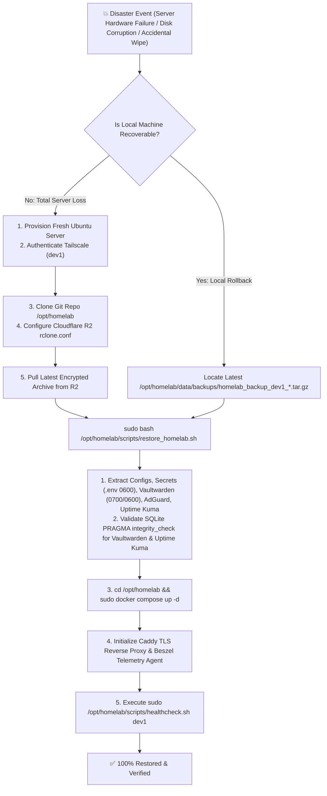

# 🚑 Disaster Recovery Runbook: dev1 (Identity, DNS & Edge Services)

> **Host**: `dev1` (`dev1.<tailnet>.ts.net` / `<dev1-tailscale-ip>`)  
> **Core Services**: Vaultwarden Password Manager, AdGuard Home DNS & Ad Blocking, Caddy Reverse Proxy (Tailscale TLS), Uptime Kuma Monitoring, Beszel Telemetry Agent  
> **Recovery Targets**: Recovery Time Objective (RTO) < 5 min • Recovery Point Objective (RPO) < 24 hrs (Daily Off-Site Cloud Snapshots)

---

## 🏛️ Architecture & Data Mapping

All persistent application state on `dev1` is structured into segregated volumes:

| Component | Host Data Path | Description | Permissions |
| :--- | :--- | :--- | :--- |
| **Secrets & Env** | `/opt/homelab/.env` & `/opt/homelab/hosts/dev1/.env` | Tailscale variables, Brevo SMTP keys, R2 offsite backup keys | `0600` (root:root) |
| **Compose Definition**| `/opt/homelab/docker-compose.yml` & `hosts/dev1/docker-compose.yml` | Container specifications, resource limits, bridge network | `0644` (root:root) |
| **Vaultwarden DB & Keys**| `/opt/homelab/data/vaultwarden/` | SQLite database (`db.sqlite3`), `rsa_key.pem`, `config.json` | `0700` / `0600` |
| **AdGuard Home Config**| `/opt/homelab/data/adguard/conf/` | DNS rewrites, upstream servers, filter lists (`AdGuardHome.yaml`) | `0700` / `0600` |
| **AdGuard Home Runtime**| `/opt/homelab/data/adguard/work/` | Query log database, DNS cache, filter engine data | `0700` (root:root) |
| **Uptime Kuma Database**| `/opt/homelab/data/uptime-kuma/` | SQLite monitor configuration (`kuma.db`), history, incidents | `0700` / `0600` |
| **Custom SMTP Provider**| `/opt/homelab/hosts/dev1/uptime-kuma/smtp.js` | Custom TLS-enabled SMTP notification driver | `0644` (ubuntu:ubuntu) |
| **Caddy TLS & Data** | `/opt/homelab/Caddyfile` & `/opt/homelab/data/caddy/` | Reverse proxy routes, Tailscale MagicDNS automatic certificates | `0700` / `0644` |
| **Local Backups** | `/opt/homelab/data/backups/` | Timestamped, permission-locked archives (`0600`) | `0700` (root:root) |
| **Cloud Offsite** | `r2-crypt:homelab/backups` | Cloudflare R2 AES-256 encrypted off-site backup vault | Zero-Knowledge Encrypted |

---

## 🔄 Disaster Recovery Workflow



---

## 🚀 Scenario 1: Total Bare-Metal Server Loss (Restore from Cloudflare R2)

Follow these steps when provisioning a replacement machine or recovering from complete data loss:

### Step 1: Base OS Setup & Tailscale Connection
On the fresh Ubuntu 22.04 / 24.04 server:
```bash
# 1. Update packages and install prerequisites
sudo apt-get update && sudo apt-get install -y curl git rclone jq ufw sqlite3 dnsutils

# 2. Install Docker & Docker Compose
curl -fsSL https://get.docker.com | sudo sh
sudo usermod -aG docker $USER

# 3. Install & Authenticate Tailscale
curl -fsSL https://tailscale.com/install.sh | sudo sh
sudo tailscale up --hostname=dev1 --accept-routes --ssh
```

### Step 2: Clone Homelab Repository
```bash
sudo git clone git@github.com:sanjay-namdeo/homelab.git /opt/homelab
sudo chown -R $USER:$USER /opt/homelab
cd /opt/homelab
```

### Step 3: Configure Cloudflare R2 Credentials
Create `/opt/homelab/data/rclone/rclone.conf`:
```bash
sudo mkdir -p /opt/homelab/data/rclone
sudo tee /opt/homelab/data/rclone/rclone.conf << 'EOF_R2'
[r2]
type = s3
provider = Cloudflare
access_key_id = <YOUR_R2_ACCESS_KEY_ID>
secret_access_key = <YOUR_R2_SECRET_ACCESS_KEY>
endpoint = https://<YOUR_ACCOUNT_ID>.r2.cloudflarestorage.com
no_check_bucket = true

[r2-crypt]
type = crypt
remote = r2:homelab/backups
filename_encryption = standard
directory_name_encryption = true
password = <YOUR_RCLONE_ENCRYPTION_PASSWORD>
EOF_R2

sudo chmod 600 /opt/homelab/data/rclone/rclone.conf
```

### Step 4: Download Latest Backup Archive
```bash
sudo mkdir -p /opt/homelab/data/backups

# List available backups in cloud
sudo rclone lsf r2-crypt: --config /opt/homelab/data/rclone/rclone.conf

# Download the latest dev1 backup
LATEST_CLOUD_BACKUP=$(sudo rclone lsf r2-crypt: --config /opt/homelab/data/rclone/rclone.conf | grep "homelab_backup_dev1_" | sort | tail -n 1)
echo "Downloading ${LATEST_CLOUD_BACKUP}..."
sudo rclone copy "r2-crypt:${LATEST_CLOUD_BACKUP}" /opt/homelab/data/backups/ --config /opt/homelab/data/rclone/rclone.conf
```

### Step 5: Execute Automated Disaster Recovery Script
```bash
BACKUP_FILE=$(sudo ls -t /opt/homelab/data/backups/homelab_backup_dev1_*.tar.gz | head -n 1)
sudo bash /opt/homelab/scripts/restore_homelab.sh "${BACKUP_FILE}"
```
*The script automatically:*
1. Unpacks environment secrets (`.env` and `hosts/dev1/.env`) with locked permissions (`0600`).
2. Restores `docker-compose.yml` and `Caddyfile`.
3. Restores Vaultwarden database (`db.sqlite3`), config, and cryptographic RSA private keys (`0700`/`0600`).
4. Restores AdGuard Home configuration (`AdGuardHome.yaml`) with restricted permissions (`0700`/`0600`).
5. Restores Uptime Kuma SQLite database (`kuma.db`) with locked permissions (`0700`/`0600`).
6. Executes `PRAGMA integrity_check;` on both SQLite databases to guarantee zero block corruption.

### Step 6: Start Stack
```bash
cd /opt/homelab
sudo docker compose up -d
```

### Step 7: Run Complete Diagnostic Healthcheck
```bash
sudo bash /opt/homelab/scripts/healthcheck.sh dev1
```

---

## ⚡ Scenario 2: Local Point-in-Time Restore (Accidental Corruption / Rollback)

If services need to be rolled back to a previous backup snapshot on the same machine:

```bash
# 1. Select latest or desired backup
BACKUP_ARCHIVE=$(sudo ls -t /opt/homelab/data/backups/homelab_backup_dev1_*.tar.gz | head -n 1)

# 2. Stop running containers
cd /opt/homelab
sudo docker compose down

# 3. Execute restore
sudo bash /opt/homelab/scripts/restore_homelab.sh "${BACKUP_ARCHIVE}"

# 4. Bring up containers
sudo docker compose up -d

# 5. Verify health
sudo bash /opt/homelab/scripts/healthcheck.sh dev1
```

---

## 🧩 Scenario 3: Granular Single-Component Recovery

### A. Restoring Vaultwarden Password Vault & RSA Keys Only
```bash
# 1. Extract vaultwarden files from backup archive
sudo tar -xzf /opt/homelab/data/backups/<backup_archive>.tar.gz -C /tmp/

# 2. Stop Vaultwarden container
sudo docker stop vaultwarden

# 3. Copy database and keys into live directory
sudo cp /tmp/vaultwarden/db.sqlite3 /opt/homelab/data/vaultwarden/db.sqlite3
[[ -f /tmp/vaultwarden/config.json ]] && sudo cp /tmp/vaultwarden/config.json /opt/homelab/data/vaultwarden/config.json
[[ -f /tmp/vaultwarden/rsa_key.pem ]] && sudo cp /tmp/vaultwarden/rsa_key.pem /opt/homelab/data/vaultwarden/rsa_key.pem

# 4. Set strict permissions
sudo chmod 700 /opt/homelab/data/vaultwarden
sudo chmod 600 /opt/homelab/data/vaultwarden/db.sqlite3 /opt/homelab/data/vaultwarden/config.json /opt/homelab/data/vaultwarden/rsa_key.pem 2>/dev/null || true

# 5. Restart Vaultwarden
sudo docker start vaultwarden
rm -rf /tmp/vaultwarden /tmp/caddy /tmp/uptime-kuma /tmp/adguard /tmp/config
```

### B. Restoring AdGuard Home Configuration & DNS Filter Rules Only
```bash
# 1. Extract adguard configuration
sudo tar -xzf /opt/homelab/data/backups/<backup_archive>.tar.gz -C /tmp/

# 2. Stop AdGuard Home container
sudo docker stop adguardhome

# 3. Copy configuration files
sudo cp -r /tmp/adguard/conf/* /opt/homelab/data/adguard/conf/
sudo chmod 700 /opt/homelab/data/adguard/conf
sudo chmod 600 /opt/homelab/data/adguard/conf/AdGuardHome.yaml

# 4. Restart AdGuard Home container
sudo docker start adguardhome
rm -rf /tmp/vaultwarden /tmp/caddy /tmp/uptime-kuma /tmp/adguard /tmp/config
```

### C. Restoring Uptime Kuma Monitoring State & Custom Notification Providers Only
```bash
# 1. Extract uptime-kuma database
sudo tar -xzf /opt/homelab/data/backups/<backup_archive>.tar.gz -C /tmp/

# 2. Stop Uptime Kuma container
sudo docker stop uptime-kuma

# 3. Copy database file
sudo cp /tmp/uptime-kuma/kuma.db /opt/homelab/data/uptime-kuma/kuma.db
sudo chmod 700 /opt/homelab/data/uptime-kuma
sudo chmod 600 /opt/homelab/data/uptime-kuma/kuma.db

# 4. Restart Uptime Kuma container
sudo docker start uptime-kuma
rm -rf /tmp/vaultwarden /tmp/caddy /tmp/uptime-kuma /tmp/adguard /tmp/config
```

### D. Restoring Caddy Reverse Proxy & TLS Configuration Only
```bash
# 1. Extract caddy configuration
sudo tar -xzf /opt/homelab/data/backups/<backup_archive>.tar.gz -C /tmp/

# 2. Copy Caddyfile
sudo cp /tmp/caddy/Caddyfile /opt/homelab/Caddyfile
[[ -f /tmp/caddy/Caddyfile.host ]] && sudo cp /tmp/caddy/Caddyfile.host /opt/homelab/hosts/dev1/Caddyfile

# 3. Reload Caddy reverse proxy
sudo docker exec caddy caddy reload --config /etc/caddy/Caddyfile
rm -rf /tmp/vaultwarden /tmp/caddy /tmp/uptime-kuma /tmp/adguard /tmp/config
```

---

## 🔍 Post-Recovery Verification Checklist

After restoring `dev1`, verify every check below:

- [ ] **Docker Containers**: All 5 containers are running and healthy (`sudo docker ps`).
- [ ] **Vaultwarden State & Integrity**:
  ```bash
  sudo python3 -c "
  import sqlite3
  con = sqlite3.connect('/opt/homelab/data/vaultwarden/db.sqlite3')
  cur = con.cursor()
  print('Ciphers:', cur.execute('SELECT count(*) FROM ciphers;').fetchone()[0])
  print('Users:', cur.execute('SELECT count(*) FROM users;').fetchone()[0])
  print('Folders:', cur.execute('SELECT count(*) FROM folders;').fetchone()[0])
  con.close()
  "
  ```
  *(Expected: 29 tables, 1 user, 235 ciphers, 5 folders, 4 devices)*
- [ ] **Vaultwarden Web UI / API**:
  ```bash
  curl -s -k -o /dev/null -w "%{http_code}\n" "https://dev1.<tailnet>.ts.net/alive"
  ```
  *(Expected: HTTP 200 OK)*
- [ ] **AdGuard Home DNS Resolution**:
  ```bash
  dig @<dev1-tailscale-ip> google.com +short +time=2
  ```
  *(Expected: Valid A record returned within milliseconds)*
- [ ] **AdGuard Home Web UI**:
  ```bash
  curl -s -k -o /dev/null -w "%{http_code}\n" "https://dev1.<tailnet>.ts.net:8081/login.html"
  ```
  *(Expected: HTTP 200 OK)*
- [ ] **Uptime Kuma Web UI**:
  ```bash
  curl -s -k -o /dev/null -w "%{http_code}\n" "https://dev1.<tailnet>.ts.net:3001"
  ```
  *(Expected: HTTP 302 redirect to `/dashboard` or HTTP 200)*
- [ ] **Caddy Reverse Proxy & HTTP Redirect**:
  ```bash
  curl -s -I "http://127.0.0.1/" | grep -i "Location:"
  ```
  *(Expected: `Location: https://dev1.<tailnet>.ts.net/`)*
- [ ] **Beszel Agent Telemetry Listener**:
  ```bash
  ss -tulpn | grep 45876
  ```
  *(Expected: Port 45876 active and listening)*
- [ ] **Full Diagnostic Check**:
  ```bash
  sudo bash /opt/homelab/scripts/healthcheck.sh dev1
  ```
  *(Expected: All items PASS)*

---

## 📜 Verified Live DR Test Record

- **Test Date**: 2026-08-29
- **Target Node**: `dev1` (Production Live Containers)
- **Test Scope**:
  - Live full backup creation with SQLite online hot-snapshots & Cloudflare R2 offsite sync.
  - Complete live stack teardown (`docker compose down`) & destructive data wipe (`.env`, `db.sqlite3`, `AdGuardHome.yaml`, `kuma.db`).
  - Full restore execution via `restore_homelab.sh`.
  - SQLite database integrity verification (`PRAGMA integrity_check;`) for Vaultwarden and Uptime Kuma.
  - Live container startup (`docker compose up -d`).
  - Verification of 235 ciphers, 15 monitors, AdGuard DNS query resolution, Caddy TLS termination, Beszel agent telemetry, and 100% healthcheck pass.
- **Outcome**: **SUCCESS** (Zero Data Loss, RTO < 3 minutes).

---

## 🔗 Related Documentation
- [[Disaster Recovery Runbook - dev2 (Finance & Monitoring)|dev2 Disaster Recovery Runbook]]
- [[Guide - Disaster Recovery & Restore|Multi-Host Disaster Recovery Guide]]
- [[Guide - Backup & Off-Site Sync|Automated Backup & Cloudflare R2 Guide]]
- [[Guide - Operations, Maintenance & Troubleshooting|Operations & Healthchecks]]
- [[Service - Vaultwarden|Vaultwarden Password Manager Guide]]
- [[Service - AdGuard Home|AdGuard Home DNS Guide]]
- [[Service - Uptime Kuma|Uptime Kuma Service Guide]]
- [[Service - Caddy Reverse Proxy|Caddy Reverse Proxy Guide]]
- [[Service - Beszel Server Monitoring|Beszel Monitoring Guide]]
- [[00 - Homelab Overview & Architecture|Homelab Overview]]
