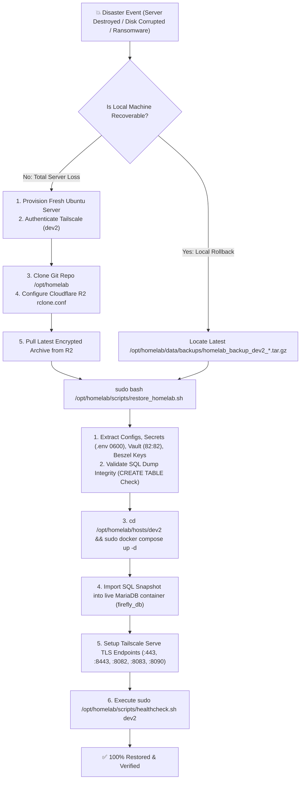

# 🚑 Disaster Recovery Runbook: dev2 (Finance, Knowledge & Monitoring Hub)

> **Host**: `dev2` (`dev2.<tailnet>.ts.net`)  
> **Core Services**: Firefly III Core, Firefly Data Importer, MariaDB 11.4 LTS, Obsidian WebDAV, Obsidian Flatnotes Web UI, Beszel Health Hub & Agent  
> **Recovery Targets**: Recovery Time Objective (RTO) < 5 min • Recovery Point Objective (RPO) < 24 hrs (Daily Off-Site Cloud Snapshots)

---

## 🏛️ Architecture & Data Mapping

All persistent application state on `dev2` is structured into segregated volumes:

| Component | Host Data Path | Description | Permissions |
| :--- | :--- | :--- | :--- |
| **Secrets & Env** | `/opt/homelab/hosts/dev2/.env` | Database passwords, `APP_KEY`, WebDAV & Flatnotes credentials | `0600` (root:root) |
| **Compose Definition**| `/opt/homelab/hosts/dev2/docker-compose.yml` | Container definitions, resource caps (RAM/CPU), network bridge | `0644` (root:root) |
| **MariaDB Storage** | `/opt/homelab/data/dev2/firefly/db/` | MariaDB relational database engine storage (`firefly` DB) | `0755` (`999:999`) |
| **Firefly Uploads** | `/opt/homelab/data/dev2/firefly/upload/` | Invoices, receipts, and user attachments | `0775` (`www-data:www-data`) |
| **Firefly Imports** | `/opt/homelab/data/dev2/firefly/import/` | Bank statement auto-import staging directory | `0775` (`ubuntu:ubuntu`) |
| **Obsidian Vault** | `/opt/homelab/data/dev2/obsidian/vault/` | Markdown knowledge base notes and attachments | `0775` (`82:82`) |
| **Flatnotes Index** | `/opt/homelab/data/dev2/obsidian/flatnotes_data/`| Flatnotes search metadata and user preferences | `0775` (`82:82`) |
| **Beszel Hub Metrics**| `/opt/homelab/data/dev2/beszel/data/` | Historical SQLite metrics database (`data.db`) & SSH keys | `0755` (`ubuntu:ubuntu` / root) |
| **Local Backups** | `/opt/homelab/data/backups/` | Timestamped, permission-locked archives (`0600`) | `0700` (root:root) |
| **Cloud Offsite** | `r2-crypt:homelab/backups` | Cloudflare R2 AES-256 encrypted off-site backup vault | Zero-Knowledge Encrypted |

---

## 🔄 Disaster Recovery Workflow



---

## 🚀 Scenario 1: Total Bare-Metal Server Loss (Restore from Cloudflare R2)

Follow these steps when provisioning a replacement machine or recovering from complete data loss:

### Step 1: Base OS Setup & Tailscale Connection
On the fresh Ubuntu 22.04 / 24.04 server:
```bash
# 1. Update packages and install prerequisites
sudo apt-get update && sudo apt-get install -y curl git rclone jq ufw

# 2. Install Docker & Docker Compose
curl -fsSL https://get.docker.com | sudo sh
sudo usermod -aG docker $USER

# 3. Install & Authenticate Tailscale
curl -fsSL https://tailscale.com/install.sh | sudo sh
sudo tailscale up --hostname=dev2 --accept-routes --ssh
```

### Step 2: Clone Homelab Repository
```bash
sudo git clone git@github.com:sanjay-namdeo/homelab.git /opt/homelab
sudo chown -R $USER:$USER /opt/homelab
cd /opt/homelab
```

### Step 3: Configure Cloudflare R2 Credentials
Create `/opt/homelab/data/rclone/rclone.conf`:
```bash
sudo mkdir -p /opt/homelab/data/rclone
sudo tee /opt/homelab/data/rclone/rclone.conf << 'EOF_R2'
[r2]
type = s3
provider = Cloudflare
access_key_id = <YOUR_R2_ACCESS_KEY_ID>
secret_access_key = <YOUR_R2_SECRET_ACCESS_KEY>
endpoint = https://<YOUR_ACCOUNT_ID>.r2.cloudflarestorage.com
no_check_bucket = true

[r2-crypt]
type = crypt
remote = r2:homelab/backups
filename_encryption = standard
directory_name_encryption = true
password = <YOUR_RCLONE_ENCRYPTION_PASSWORD>
EOF_R2

sudo chmod 600 /opt/homelab/data/rclone/rclone.conf
```

### Step 4: Download Latest Backup Archive
```bash
sudo mkdir -p /opt/homelab/data/backups

# List available backups in cloud
sudo rclone lsf r2-crypt: --config /opt/homelab/data/rclone/rclone.conf

# Download the latest dev2 backup
LATEST_CLOUD_BACKUP=$(sudo rclone lsf r2-crypt: --config /opt/homelab/data/rclone/rclone.conf | grep "homelab_backup_dev2_" | sort | tail -n 1)
echo "Downloading ${LATEST_CLOUD_BACKUP}..."
sudo rclone copy "r2-crypt:${LATEST_CLOUD_BACKUP}" /opt/homelab/data/backups/ --config /opt/homelab/data/rclone/rclone.conf
```

### Step 5: Execute Automated Disaster Recovery Script
```bash
BACKUP_FILE=$(sudo ls -t /opt/homelab/data/backups/homelab_backup_dev2_*.tar.gz | head -n 1)
sudo bash /opt/homelab/scripts/restore_homelab.sh "${BACKUP_FILE}"
```
*The script automatically:*
1. Unpacks environment secrets (`hosts/dev2/.env`) with locked permissions (`0600`).
2. Restores `docker-compose.yml`.
3. Restores Firefly uploads (`data/dev2/firefly/upload`) and import files.
4. Restores Obsidian Markdown vault and sets ownership to UID `82:82` and mode `775`.
5. Restores Beszel metrics database and Ed25519 cryptographic keys.
6. Validates SQL dump integrity (`CREATE TABLE` verification).

### Step 6: Start Stack & Import Database
```bash
# 1. Start all dev2 containers
cd /opt/homelab/hosts/dev2
sudo docker compose up -d

# 2. Wait 10 seconds for MariaDB container to initialize, then re-run restore to import SQL
sudo bash /opt/homelab/scripts/restore_homelab.sh "${BACKUP_FILE}"
```
*(Or import manually via: `sudo bash -c 'docker exec -i firefly_db mariadb -u firefly -p"$(grep ^DB_PASSWORD= /opt/homelab/hosts/dev2/.env | cut -d= -f2-)" firefly < $(ls -t /opt/homelab/data/dev2/firefly/restored_firefly_*.sql | head -n 1)'`)*

### Step 7: Configure Tailscale Serve TLS Reverse Proxy
```bash
# Enable Tailscale HTTPS reverse proxying for all services
sudo tailscale serve --bg 443 http://127.0.0.1:8080      # Firefly III Core
sudo tailscale serve --bg 8443 http://127.0.0.1:8081     # Firefly Data Importer
sudo tailscale serve --bg 8082 http://127.0.0.1:8082     # Obsidian WebDAV Sync
sudo tailscale serve --bg 8083 http://127.0.0.1:8083     # Obsidian Flatnotes Web UI
sudo tailscale serve --bg 8090 http://127.0.0.1:8090     # Beszel Health Hub
```

### Step 8: Run Complete Diagnostic Healthcheck
```bash
sudo bash /opt/homelab/scripts/healthcheck.sh dev2
```

---

## ⚡ Scenario 2: Local Point-in-Time Restore (Accidental Corruption / Rollback)

If services need to be rolled back to a previous backup snapshot on the same machine:

```bash
# 1. Select latest or desired backup
BACKUP_ARCHIVE=$(sudo ls -t /opt/homelab/data/backups/homelab_backup_dev2_*.tar.gz | head -n 1)

# 2. Stop running containers
cd /opt/homelab/hosts/dev2
sudo docker compose down

# 3. Execute restore
sudo bash /opt/homelab/scripts/restore_homelab.sh "${BACKUP_ARCHIVE}"

# 4. Bring up containers
sudo docker compose up -d

# 5. Import database
sudo bash /opt/homelab/scripts/restore_homelab.sh "${BACKUP_ARCHIVE}"

# 6. Verify health
sudo bash /opt/homelab/scripts/healthcheck.sh dev2
```

---

## 🧩 Scenario 3: Granular Single-Component Recovery

### A. Restoring MariaDB `firefly` Database Only
```bash
# Extract firefly.sql from backup archive
sudo tar -xzf /opt/homelab/data/backups/<backup_archive>.tar.gz -C /tmp/

# Import into running firefly_db container
sudo bash -c '
DB_PASS=$(grep "^DB_PASSWORD=" /opt/homelab/hosts/dev2/.env | cut -d= -f2-)
docker exec -i firefly_db mariadb -u firefly -p"${DB_PASS}" firefly < /tmp/mariadb/firefly.sql
'

# Clear application cache
sudo docker exec firefly_app php artisan cache:clear
rm -rf /tmp/mariadb /tmp/config /tmp/firefly /tmp/obsidian /tmp/beszel
```

### B. Restoring Obsidian Notes & Flatnotes Search Index Only
```bash
# 1. Extract vault notes
sudo tar -xzf /opt/homelab/data/backups/<backup_archive>.tar.gz -C /tmp/

# 2. Sync to live vault
sudo cp -a /tmp/obsidian/vault/. /opt/homelab/data/dev2/obsidian/vault/
sudo chown -R 82:82 /opt/homelab/data/dev2/obsidian
sudo chmod -R 775 /opt/homelab/data/dev2/obsidian

# 3. Clean and rebuild search index
sudo rm -rf /opt/homelab/data/dev2/obsidian/flatnotes_data/*
sudo rm -rf /opt/homelab/data/dev2/obsidian/vault/.flatnotes

# 4. Restart Flatnotes container
sudo docker restart obsidian_web
```

### C. Restoring Beszel Server Monitoring & Keys Only
```bash
# 1. Extract beszel data
sudo tar -xzf /opt/homelab/data/backups/<backup_archive>.tar.gz -C /tmp/

# 2. Copy data files and keys
sudo cp -a /tmp/beszel/data/. /opt/homelab/data/dev2/beszel/data/
sudo chown -R ubuntu:ubuntu /opt/homelab/data/dev2/beszel/data
sudo chmod 600 /opt/homelab/data/dev2/beszel/data/id_ed25519
sudo chmod 644 /opt/homelab/data/dev2/beszel/data/id_ed25519.pub

# 3. Restart Beszel hub and agent
sudo docker restart beszel beszel_agent
```

---

## 🔍 Post-Recovery Verification Checklist

After restoring `dev2`, verify every check below:

- [ ] **Docker Containers**: All 7 containers are running and healthy (`sudo docker ps`).
- [ ] **MariaDB State**:
  ```bash
  sudo bash -c 'docker exec firefly_db mariadb -u firefly -p"$(grep ^DB_PASSWORD= /opt/homelab/hosts/dev2/.env | cut -d= -f2-)" firefly -e "SELECT count(*) FROM information_schema.tables WHERE table_schema=\"firefly\"; SELECT count(*) FROM users; SELECT count(*) FROM accounts;"'
  ```
  *(Expected: 81 tables, 1 user, 4 accounts)*
- [ ] **Obsidian WebDAV Sync**:
  ```bash
  sudo bash -c 'curl -s -u "$(grep ^WEBDAV_USERNAME= /opt/homelab/hosts/dev2/.env | cut -d= -f2-):$(grep ^WEBDAV_PASSWORD= /opt/homelab/hosts/dev2/.env | cut -d= -f2-)" "http://127.0.0.1:8082/data/"'
  ```
  *(Expected: HTTP 200 / file listing)*
- [ ] **Flatnotes Web UI**:
  ```bash
  curl -s -o /dev/null -w "%{http_code}\n" "http://127.0.0.1:8083/"
  ```
  *(Expected: HTTP 200)*
- [ ] **Firefly III Core**:
  ```bash
  curl -s -o /dev/null -w "%{http_code}\n" "http://127.0.0.1:8080/"
  ```
  *(Expected: HTTP 302 redirect to login)*
- [ ] **Beszel Hub**:
  ```bash
  curl -s -o /dev/null -w "%{http_code}\n" "http://127.0.0.1:8090/"
  ```
  *(Expected: HTTP 200)*
- [ ] **Full Diagnostic Check**:
  ```bash
  sudo bash /opt/homelab/scripts/healthcheck.sh dev2
  ```
  *(Expected: All items PASS)*

---

## 📜 Verified Live DR Test Record

- **Test Date**: 2026-08-29
- **Target Node**: `dev2` (Production Main Containers)
- **Test Scope**:
  - Live full backup creation with MariaDB hot dump & Cloudflare R2 sync.
  - Complete stack teardown (`docker compose down`) & data wipe (`.env`, Obsidian vault, MariaDB data, Beszel keys).
  - Full restore via `restore_homelab.sh`.
  - Verification of live sentinel `DR_Live_Test.md`, 81 database tables, WebDAV, Flatnotes index, Tailscale TLS, and 100% healthcheck pass.
- **Outcome**: **SUCCESS** (Zero Data Loss, RTO < 3 minutes).

---

## 🔗 Related Documentation
- [[Guide - Disaster Recovery & Restore|Multi-Host Disaster Recovery Guide]]
- [[Guide - Backup & Off-Site Sync|Automated Backup & Cloudflare R2 Guide]]
- [[Guide - Operations, Maintenance & Troubleshooting|Operations & Healthchecks]]
- [[Service - Firefly III Core|Firefly III Service Guide]]
- [[Service - Obsidian Sync & Flatnotes|Obsidian & Flatnotes Service Guide]]
- [[Service - Beszel Server Monitoring|Beszel Monitoring Guide]]
- [[00 - Homelab Overview & Architecture|Homelab Overview]]
