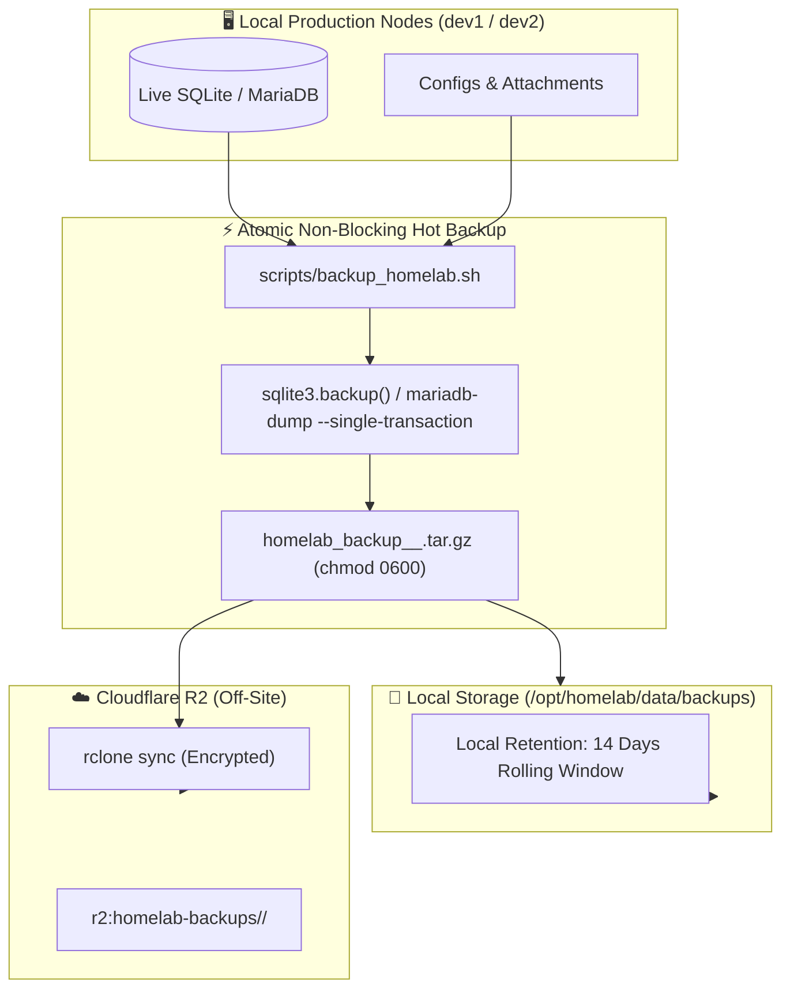

# 💾 Guide: Automated Backups & Cloudflare R2 Off-Site Sync

This guide details the homelab's multi-host, zero-downtime automated backup architecture, retention policies, and off-site cloud replication workflows.

---

## 🎯 3-2-1 Backup Strategy

Our homelab adheres to the enterprise **3-2-1 Backup Principle**:
- **3 Copies of Data:** Production data, local timestamped snapshots, and off-site cloud archives.
- **2 Different Storage Media:** Local NVMe/SSD storage and Cloudflare R2 Object Storage.
- **1 Off-Site Copy:** Geographically redundant, immutable cloud bucket at Cloudflare R2.



---

## ⚙️ How the Backup Script Works

The automated backup script located at `/opt/homelab/scripts/backup_homelab.sh` dynamically detects the host node (`dev1` vs `dev2`) and executes hot atomic backups:

### On `dev1` (Identity & DNS Node):
1. **Vaultwarden SQLite Hot Backup:** Uses Python's `sqlite3.backup()` API to lock and stream an atomic point-in-time clone of `db.sqlite3` without taking the container offline.
2. **Uptime Kuma SQLite Hot Backup:** Captures atomic copy of `kuma.db` and icon assets.
3. **AdGuard Home:** Archives `AdGuardHome.yaml` config and DNS query history.
4. **Caddy Reverse Proxy:** Backs up `Caddyfile`, Let's Encrypt TLS certificates, and runtime state.
5. **Environment & Compose:** Captures `/opt/homelab/.env` and `docker-compose.yml`.

### On `dev2` (Finance, Obsidian & Monitoring Node):
1. **MariaDB Atomic Dump:** Executes `mariadb-dump -u firefly -p<pass> --single-transaction --quick firefly` (ACID transaction-safe without blocking table writes).
2. **Firefly Attachments:** Archives all invoice/receipt uploads in `data/dev2/firefly/upload`.
3. **Firefly Importer:** Archives configurations in `data/dev2/firefly/import`.
4. **Obsidian Vault & Flatnotes:** Captures all markdown notes, attachments, and search index files.
5. **Beszel Hub:** Captures metrics database and authentication keys in `data/dev2/beszel/data`.
6. **Environment Secrets:** Archives `hosts/dev2/.env` (including critical `APP_KEY` encryption key).

---

## 🚀 Running Manual Backups

You can trigger a backup at any time with a single command:

```bash
# Auto-detect current host
sudo bash /opt/homelab/scripts/backup_homelab.sh

# Explicitly target dev1
sudo bash /opt/homelab/scripts/backup_homelab.sh --host dev1

# Explicitly target dev2
sudo bash /opt/homelab/scripts/backup_homelab.sh --host dev2
```

### Snapshot Output & Permissions
- Snapshot files are written to: `/opt/homelab/data/backups/homelab_backup_<host>_<YYYYMMDD_HHMMSS>.tar.gz`
- Files are secured with strict `chmod 0600` permissions (root read/write only).

---

## ☁️ Setting Up Off-Site Sync (Cloudflare R2)

Cloudflare R2 provides S3-compatible, ultra-fast object storage with **zero egress bandwidth fees**.

### Step 1: Create R2 Bucket & API Token
1. Log into your [Cloudflare Dashboard](https://dash.cloudflare.com/) ➔ **R2 Object Storage**.
2. Click **Create bucket**, name it `homelab-backups`.
3. Click **Manage R2 API Tokens** ➔ **Create API Token**:
   - Permissions: `Object Read & Write`
   - Specify bucket: `homelab-backups`
4. Copy:
   - **Account ID**
   - **Access Key ID**
   - **Secret Access Key**

### Step 2: Configure `rclone`
Run on `dev1` and `dev2`:
```bash
sudo rclone config
```
- **Name:** `r2`
- **Storage Type:** `s3`
- **Provider:** `Cloudflare`
- **Access Key / Secret Key:** Enter the copied credentials.
- **Endpoint:** `https://<ACCOUNT_ID>.r2.cloudflarestorage.com`
- **ACL:** `private`

### Step 3: Test Cloudflare R2 Sync
```bash
sudo rclone lsd r2:
sudo bash /opt/homelab/scripts/backup_homelab.sh
```
The backup script will automatically detect `r2` and sync the archive off-site!

---

## ⏰ Automated Cron Scheduling

To ensure backups run every night at **03:00 AM** with automatic 14-day rotation:

Edit system crontab (`sudo crontab -e`):
```cron
# Homelab Daily Automated Backup & Off-Site Sync (03:00 AM)
0 3 * * * /bin/bash /opt/homelab/scripts/backup_homelab.sh >> /var/log/homelab_backup.log 2>&1
```

---

## 🔍 Backup Verification & Monitoring

Uptime Kuma and our healthcheck tool monitor backup freshness:

```bash
# Run homelab diagnostic healthcheck
sudo bash /opt/homelab/scripts/healthcheck.sh
```

The script verifies:
- Backup archive exists in `/opt/homelab/data/backups/`
- Most recent archive was generated within the last **26 hours**
- Archive tar integrity check (`tar -tzf`) passes without corruption

---

## 🔗 Related Notes
- [[Guide - Disaster Recovery & Restore|Disaster Recovery & Restore Runbook]]
- [[Guide - Operations, Maintenance & Troubleshooting|Operations & Healthchecks]]
- [[00 - Homelab Overview & Architecture|Homelab Overview]]
