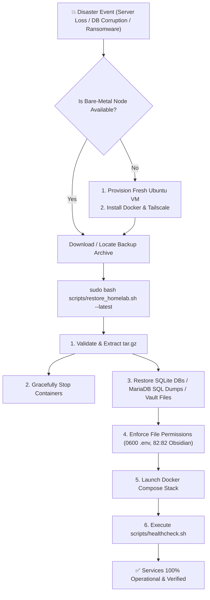

# 🚑 Guide: Disaster Recovery & Complete Server Restoration

This runbook outlines step-by-step disaster recovery procedures for restoring individual corrupted services or performing complete bare-metal recovery from local snapshots or Cloudflare R2 cloud backups.

---

## 🎯 Recovery Objectives

- **Recovery Time Objective (RTO):** < 5 minutes (from snapshot archive to fully operational service stack).
- **Recovery Point Objective (RPO):** < 24 hours (nightly automated snapshots).



---

## 🚀 1-Command Automated Restore

Our automated restoration utility located at `/opt/homelab/scripts/restore_homelab.sh` handles end-to-end database restoration, file permission enforcement, container restarts, and data verification.

### Scenario A: Interactive Restore (Select from Available Backups)
```bash
sudo bash /opt/homelab/scripts/restore_homelab.sh
```
*The script will present a numbered menu of all local archives in `/opt/homelab/data/backups/`, displaying dates, hosts, and file sizes.*

### Scenario B: Fast-Track Restore (Latest Available Backup)
```bash
sudo bash /opt/homelab/scripts/restore_homelab.sh --latest
```

### Scenario C: Restore Specific Archive File
```bash
sudo bash /opt/homelab/scripts/restore_homelab.sh /path/to/homelab_backup_dev1_20260829_030000.tar.gz
```

---

## ☁️ Restoring from Cloudflare R2 (Off-Site Recovery)

If the entire local server or disk was destroyed:

1. On the new server, install `rclone`:
   ```bash
   sudo apt-get update && sudo apt-get install -y rclone
   sudo rclone config
   # (Configure 'r2' remote using Cloudflare credentials)
   ```
2. List and download the latest off-site backup:
   ```bash
   mkdir -p /opt/homelab/data/backups
   sudo rclone copy r2:homelab-backups/ /opt/homelab/data/backups/
   ```
3. Run the automated restore script:
   ```bash
   sudo bash /opt/homelab/scripts/restore_homelab.sh --latest
   ```

---

## 🏗️ Bare-Metal Server Full Replication Runbook

To rebuild a destroyed homelab node from zero:

### Step 1: Clone Repository
```bash
sudo git clone git@github.com:sanjay-namdeo/homelab.git /opt/homelab
cd /opt/homelab
```

### Step 2: Deploy Stack Prerequisites & Tailscale
```bash
# On dev1:
sudo bash scripts/deploy_stack.sh dev1

# On dev2:
sudo bash scripts/deploy_stack.sh dev2
```

### Step 3: Execute Restoration
```bash
sudo bash scripts/restore_homelab.sh /path/to/backup.tar.gz
```

### Step 4: Run Health Diagnostics
```bash
sudo bash scripts/healthcheck.sh
```

---

## 🧩 Granular Single-Service Manual Restores

If only one service requires restoration (e.g. accidentally deleted Vaultwarden item or corrupted MariaDB table):

### 1. Vaultwarden SQLite Database
```bash
# 1. Stop container
docker stop vaultwarden

# 2. Extract SQLite database from backup archive
tar -xzf /opt/homelab/data/backups/<backup_archive>.tar.gz -C /tmp/

# 3. Replace database file
cp /tmp/vaultwarden/db.sqlite3 /opt/homelab/data/vaultwarden/db.sqlite3
rm -f /opt/homelab/data/vaultwarden/db.sqlite3-wal /opt/homelab/data/vaultwarden/db.sqlite3-shm

# 4. Start container
docker start vaultwarden
```

### 2. Firefly III MariaDB Relational Database
```bash
# 1. Extract SQL dump
tar -xzf /opt/homelab/data/backups/<backup_archive>.tar.gz -C /tmp/

# 2. Import SQL dump into running database container
docker exec -i firefly_db mariadb -u firefly -p<DB_PASSWORD> firefly < /tmp/mariadb/firefly.sql

# 3. Clear application cache
docker exec -i firefly_app php artisan cache:clear
```

### 3. Obsidian Vault & Flatnotes Notes
```bash
# 1. Extract notes
tar -xzf /opt/homelab/data/backups/<backup_archive>.tar.gz -C /tmp/

# 2. Restore vault directory
cp -a /tmp/obsidian/vault/. /opt/homelab/data/dev2/obsidian/vault/

# 3. Re-enforce permissions
sudo chown -R 82:82 /opt/homelab/data/dev2/obsidian/vault
sudo chmod -R 775 /opt/homelab/data/dev2/obsidian/vault

# 4. Restart Flatnotes to rebuild search index
docker restart obsidian_web
```

---

## ✅ Post-Restoration Verification Checklist

After any restore operation, verify the following:
- [ ] `sudo bash /opt/homelab/scripts/healthcheck.sh` passes all checks with `0 FAIL`.
- [ ] Tailscale MagicDNS resolves and connects with valid HTTPS certificate.
- [ ] Vaultwarden accepts master password and displays vault ciphers.
- [ ] AdGuard Home processes DNS queries (`dig @127.0.0.1 google.com`).
- [ ] Firefly III opens ledger accounts without SQL migration errors.
- [ ] Obsidian Remotely Save and Flatnotes load all notes and attachments.
- [ ] Beszel dashboard displays live system CPU/RAM graphs.

---

## 🔗 Related Notes
- [[Guide - Backup & Off-Site Sync|Automated Backup & Snapshot Guide]]
- [[Guide - Operations, Maintenance & Troubleshooting|Operations & Healthchecks]]
- [[00 - Homelab Overview & Architecture|Homelab Architecture]]
