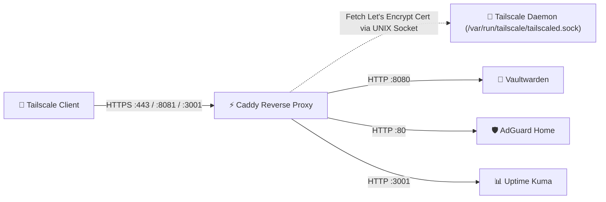

# ⚡ Service: Caddy Reverse Proxy (Automated TLS & Ingress)

**Caddy** is an enterprise-ready, open-source HTTP/2 and HTTP/3 reverse proxy with native support for automatic TLS certificate management. In our homelab on `dev1`, Caddy connects directly to Tailscale's local daemon to obtain trusted Let's Encrypt certificates for `*.ts.net` domains with zero public DNS verification.

---

## 🏗️ Architecture & Deployment

- **Host Node:** `dev1`
- **Docker Image:** `caddy:alpine`
- **Exposed Ingress Ports:**
  - `0.0.0.0:80` (HTTP redirect to HTTPS)
  - `0.0.0.0:443` (HTTPS for Vaultwarden)
  - `<dev1-tailscale-ip>:8081` & `127.0.0.1:8081` (HTTPS for AdGuard Home)
  - `<dev1-tailscale-ip>:3001` & `127.0.0.1:3001` (HTTPS for Uptime Kuma)
- **Tailscale Socket Mount:** `/var/run/tailscale/tailscaled.sock:ro` (allows Caddy to fetch certificates from Tailscale)
- **Configuration File:** `/opt/homelab/Caddyfile` (or `/opt/homelab/hosts/dev1/Caddyfile`)
- **Data & Certificate Storage:** `/opt/homelab/data/caddy/data` and `/opt/homelab/data/caddy/config`
- **Resource Constraints:** Max 64 MB RAM, 0.50 vCPU (~15 MB idle)



---

## 📝 Caddyfile Breakdown

Here is the exact production configuration deployed on `dev1`:

```caddy
{
    # Global options
    auto_https disable_redirects
}

# 1. Main Root Domain (Vaultwarden on Port 443)
{$TAILSCALE_DOMAIN:dev1.<tailnet>.ts.net} {
    tls {
        get_certificate tailscale
    }
    
    # Reverse proxy to Vaultwarden backend
    reverse_proxy 127.0.0.1:8080 {
        header_up X-Real-IP {remote_host}
        header_up X-Forwarded-For {remote_host}
        header_up X-Forwarded-Proto {scheme}
    }
}

# 2. AdGuard Home Web Interface (Port 8081)
{$TAILSCALE_DOMAIN:dev1.<tailnet>.ts.net}:8081 {
    tls {
        get_certificate tailscale
    }
    reverse_proxy 127.0.0.1:80
}

# 3. Uptime Kuma Interface (Port 3001)
{$TAILSCALE_DOMAIN:dev1.<tailnet>.ts.net}:3001 {
    tls {
        get_certificate tailscale
    }
    reverse_proxy 127.0.0.1:3001
}
```

### Key Directives Explained:
- **`tls { get_certificate tailscale }`**: Communicates with `tailscaled.sock` to dynamically fetch and renew valid Let's Encrypt certificates issued to the machine's MagicDNS FQDN.
- **`header_up`**: Forwards original client IP headers so backend services (like Vaultwarden audit logs) accurately record client endpoints.
- **WebSocket Compatibility**: Caddy automatically detects and upgrades WebSocket connections (required for Bitwarden sync and Uptime Kuma live telemetry) with zero extra config.

---

## ➕ Adding a New Service to Caddy

To route a new internal service (e.g. running on `127.0.0.1:9000` on port `9000` over HTTPS):

1. Edit `/opt/homelab/Caddyfile`:
   ```caddy
   {$TAILSCALE_DOMAIN:dev1.<tailnet>.ts.net}:9000 {
       tls {
           get_certificate tailscale
       }
       reverse_proxy 127.0.0.1:9000
   }
   ```
2. Expose the port in `docker-compose.yml` on Caddy (bound to Tailscale IP or `0.0.0.0`).
3. Reload Caddy configuration with zero downtime:
   ```bash
   docker exec -w /etc/caddy caddy caddy reload
   ```

---

## 💾 Backup & Data Protection

Caddy's runtime state and cached TLS certificates are stored in `/opt/homelab/data/caddy/`.

The automated backup script (`scripts/backup_homelab.sh`) archives:
- `/opt/homelab/Caddyfile`
- `/opt/homelab/data/caddy/data` (certificates, OCSP stapling data)
- `/opt/homelab/data/caddy/config` (autosave runtime state)

---

## 🛠️ Troubleshooting & Commands

| Task | Command |
| :--- | :--- |
| **Check Caddy Status** | `docker ps -f name=caddy` |
| **View Live Logs** | `docker logs -f caddy` |
| **Validate Caddyfile Syntax** | `docker exec -w /etc/caddy caddy caddy validate` |
| **Reload Without Downtime** | `docker exec -w /etc/caddy caddy caddy reload` |
| **Verify Tailscale Socket Access** | `ls -la /var/run/tailscale/tailscaled.sock` |

---

## 🔗 Related Notes
- [[Service - Tailscale WireGuard Mesh|Tailscale WireGuard Mesh & MagicDNS]]
- [[Service - Vaultwarden|Vaultwarden Configuration Guide]]
- [[Service - AdGuard Home|AdGuard Home DNS Configuration]]
