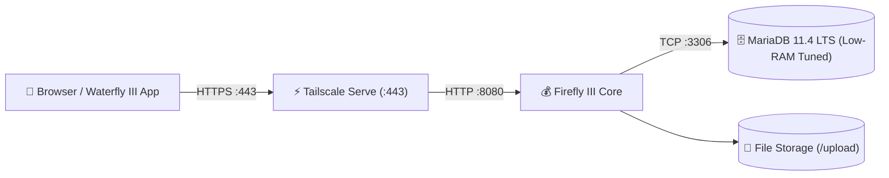

# 💰 Service: Firefly III Core (Personal Finance & Accounting)

**Firefly III** is a self-hosted personal finance manager designed around double-entry bookkeeping principles. It allows tracking income, expenses, budgets, savings goals, recurring bills, and multi-currency assets without sharing banking credentials with third-party aggregators.

---

## 🏗️ Architecture & Deployment

- **Host Node:** `dev2`
- **Application Image:** `fireflyiii/core:latest`
- **Database Image:** `mariadb:lts` (MariaDB 11.4 LTS)
- **Local Application Port:** `127.0.0.1:8080`
- **Tailscale HTTPS Access:** `https://dev2.<tailnet>.ts.net` (Port 443 via Tailscale Serve)
- **Data Storage:**
  - Database data: `/opt/homelab/data/dev2/firefly/db`
  - Uploaded receipts/attachments: `/opt/homelab/data/dev2/firefly/upload`
- **Resource Constraints (1GB RAM Optimization):**
  - `firefly_app`: Max 384 MB RAM, 1.0 vCPU
  - `firefly_db`: Max 256 MB RAM, 0.75 vCPU
  - MariaDB command tuning: `--innodb-buffer-pool-size=128M --performance_schema=OFF --max-connections=50`

---

## ⚙️ Initial Setup & Financial Structure

### 1. Account Types in Double-Entry Bookkeeping
- **Asset Accounts:** Bank checking accounts, savings accounts, physical wallets/cash, investment portfolios.
- **Expense Accounts:** Merchants and payees where money is spent (e.g. *Supermarket, Amazon, Netflix, Landlord*).
- **Revenue Accounts:** Sources of income (e.g. *Employer Salary, Dividends, Cashbacks*).
- **Liabilities:** Credit card balances, loans, mortgages.

### 2. First-Time Setup Wizard
1. Open `https://dev2.<tailnet>.ts.net` on your Tailscale-connected browser.
2. Register your primary administrator email and password.
3. Configure your default base currency (e.g., `USD`, `EUR`, `INR`, `GBP`).
4. Create your primary **Asset Account** (e.g., *Main Checking Account*) and enter your opening balance.

---

## 🚀 Advanced Workflows

### 1. Budgets & Categories
- **Budgets:** Set spending limits per time period (e.g., *Groceries - $400/month*).
- **Categories:** Classify transaction intent regardless of budget (e.g., *Food, Transport, Health, Utilities*).

### 2. Rules & Automation Engine
Automate categorization and tagging of incoming transactions:
- Go to **Automation** ➔ **Rules** ➔ **Create Rule**.
- Example Rule:
  - **Trigger:** Description contains `Uber` OR `Lyft`
  - **Action:** Set category to `Transportation`, Set budget to `Monthly Commute`.

### 3. Recurring Transactions & Subscriptions
- Configure recurring bills with exact due dates and repeat cycles.
- Firefly III automatically projects upcoming cash flow and reminds you of pending debits.

### 4. Piggy Banks (Savings Goals)
- Allocate virtual sub-balances within asset accounts towards specific goals (e.g. *Emergency Fund, Vacation, New Laptop*).

---

## 📱 Mobile App Sync (Waterfly III)

**Waterfly III** is an open-source Android client for Firefly III:
1. In Firefly III web UI, navigate to **Profile** ➔ **OAuth** ➔ **Personal Access Tokens**.
2. Click **Create New Token**, name it `Waterfly App`, and copy the token.
3. Open Waterfly III on your Android device.
4. Set Server URL: `https://dev2.<tailnet>.ts.net`
5. Paste your Personal Access Token and connect.

---

## 💾 Backup & Data Protection

Firefly III stores all transactions and double-entry ledgers in MariaDB.

The automated backup script (`scripts/backup_homelab.sh --host dev2`) performs:
- **Hot Atomic Database Dump:** Uses `mariadb-dump --single-transaction --quick firefly` (zero database downtime).
- **Attachment Archive:** Compresses `/opt/homelab/data/dev2/firefly/upload` containing receipts, invoice PDFs, and transaction attachments.
- **Environment Secrets:** Backs up `hosts/dev2/.env` containing `APP_KEY` (critical for encrypting financial fields).

---

## 🛠️ Operational & Maintenance Commands

| Task | Command |
| :--- | :--- |
| **Check Firefly Status** | `docker ps -f name=firefly_` |
| **View App Logs** | `docker logs -f firefly_app` |
| **View MariaDB Logs** | `docker logs -f firefly_db` |
| **Run Database Migrations** | `docker exec -it firefly_app php artisan migrate --force` |
| **Clear App Cache** | `docker exec -it firefly_app php artisan cache:clear` |
| **Manual DB Dump** | `docker exec firefly_db mariadb-dump -u firefly -p<pass> --single-transaction firefly > dump.sql` |

---

## 🔗 Related Notes
- [[Service - Firefly III Data Importer|Firefly Data Importer Guide]]
- [[Guide - Backup & Off-Site Sync|Homelab Backup & Snapshot Guide]]
- [[Guide - Disaster Recovery & Restore|Firefly Disaster Recovery]]
