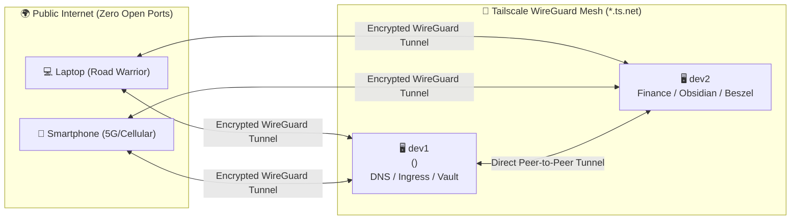

# 🔐 Service: Tailscale WireGuard Mesh & MagicDNS

**Tailscale** provides the encrypted mesh overlay network connecting all homelab servers (`dev1`, `dev2`) and client devices (laptops, phones, tablets) into a private WireGuard network without open WAN firewall ports.

---

## 🏗️ Architecture & Network Topology

- **Network Technology:** WireGuard (ChaCha20-Poly1305 authenticated encryption)
- **Overlay Subnet:** `100.64.0.0/10` Carrier-Grade NAT address space
- **MagicDNS Domain:** `<machine>.<tailnet-id>.ts.net` (e.g. `dev1.<tailnet>.ts.net`, `dev2.<tailnet>.ts.net`)
- **Key Features Enabled:**
  - **MagicDNS:** Automatic hostname resolution and automatic Let's Encrypt certificates.
  - **Tailscale SSH:** Keyless, ACL-authenticated root/user shell access.
  - **Exit Node Routing:** Encrypted full-tunnel Internet browsing through the homelab server.
  - **Tailscale Serve:** Built-in TLS reverse proxy on `dev2`.



---

## 🚀 Server Enrollment & Authentication

To enroll a new homelab server node into your tailnet:

```bash
# 1. Install Tailscale package (if not present)
curl -fsSL https://tailscale.com/install.sh | sh

# 2. Enable & start tailscaled service
sudo systemctl enable --now tailscaled

# 3. Authenticate with SSH & Exit Node capabilities
sudo tailscale up --ssh --advertise-exit-node --accept-routes
```

### Exit Node Approval (In Tailscale Admin Console)
1. Navigate to the [Tailscale Machines Admin](https://login.tailscale.com/admin/machines).
2. Find your server (`dev1` or `dev2`).
3. Click the `...` menu ➔ **Edit route settings**.
4. Check the box to approve **Use as exit node**.

---

## ⚡ Tailscale Serve (Reverse Proxy on `dev2`)

On `dev2`, native `tailscale serve` is used to terminate TLS across five separate ports directly to local container ports:

```bash
# Firefly III Core -> Port 443
sudo tailscale serve --bg --https=443 http://127.0.0.1:8080

# Firefly III Data Importer -> Port 8443
sudo tailscale serve --bg --https=8443 http://127.0.0.1:8081

# Obsidian WebDAV Sync -> Port 8082
sudo tailscale serve --bg --https=8082 http://127.0.0.1:8082

# Obsidian Flatnotes Web -> Port 8083
sudo tailscale serve --bg --https=8083 http://127.0.0.1:8083

# Beszel Health Hub -> Port 8090
sudo tailscale serve --bg --https=8090 http://127.0.0.1:8090
```

### Check Serve Status
```bash
tailscale serve status
```

---

## 🛡️ Kernel Tuning for IP Forwarding & Exit Nodes

To allow seamless routing when acting as an Exit Node, the following sysctl parameters are applied via `/etc/sysctl.d/99-homelab.conf`:

```ini
net.ipv4.ip_forward = 1
net.ipv6.conf.all.forwarding = 1
```

Apply immediately with:
```bash
sudo sysctl --system
```

---

## 🛠️ Diagnostic & Operational Commands

| Task | Command |
| :--- | :--- |
| **Check Network Status** | `tailscale status` |
| **Inspect JSON & DNS Name** | `tailscale status --json \| jq '.Self.DNSName'` |
| **Test Peer-to-Peer Latency** | `tailscale ping dev2` |
| **Check Connection Details** | `tailscale netcheck` |
| **Inspect Active Ingress/Serve** | `tailscale serve status` |
| **Check Tailscale IP** | `tailscale ip -4` |

---

## 🔗 Related Notes
- [[Service - Caddy Reverse Proxy|Caddy Reverse Proxy & MagicDNS TLS]]
- [[Service - AdGuard Home|AdGuard Home Global DNS over Tailscale]]
- [[00 - Homelab Overview & Architecture|Homelab Overview]]
