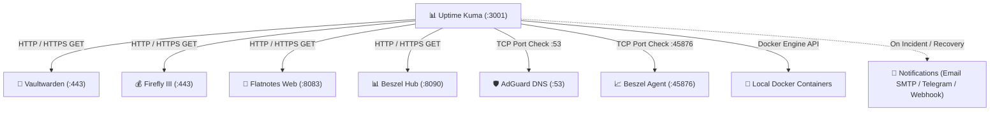

# 📊 Service: Uptime Kuma (Monitoring & Alerting Hub)

**Uptime Kuma** is a self-hosted monitoring tool that tracks uptime, response latency, certificate expiration, and health across all homelab services, delivering real-time alerts via Email, Telegram, and Webhooks.

---

## 🏗️ Architecture & Deployment

- **Host Node:** `dev1`
- **Docker Image:** `louislam/uptime-kuma:1`
- **Internal Port:** `127.0.0.1:3001`
- **Tailscale HTTPS Access:** `https://dev1.<tailnet>.ts.net:3001` (via Caddy Reverse Proxy)
- **Database:** SQLite embedded database (`/opt/homelab/data/uptime-kuma/kuma.db`)
- **Docker Socket Mount:** `/var/run/docker.sock:ro` (enables Docker container status monitoring)
- **Resource Limits:** Max 128 MB RAM, 0.50 vCPU

---

## ⚙️ Initial Setup & Admin Account

1. Connect to Tailscale on your client device.
2. Open: **`https://dev1.<tailnet>.ts.net:3001`**
3. Create your administrative username and secure password on first launch.

---

## 🔍 Recommended Monitors Configuration

### 1. HTTP(s) Service Monitors
| Monitor Name | Type | Target URL | Interval | Accepted Status Codes |
| :--- | :--- | :--- | :--- | :--- |
| **Vaultwarden Web** | `HTTP(s)` | `https://dev1.<tailnet>.ts.net/alive` | 60s | `200-299` |
| **AdGuard Home Web** | `HTTP(s)` | `https://dev1.<tailnet>.ts.net:8081` | 60s | `200-299` |
| **Firefly III Core** | `HTTP(s)` | `https://dev2.<tailnet>.ts.net` | 60s | `200-299`, `302` |
| **Firefly Data Importer**| `HTTP(s)` | `https://dev2.<tailnet>.ts.net:8443` | 120s | `200-299`, `302` |
| **Obsidian WebDAV** | `HTTP(s)` | `https://dev2.<tailnet>.ts.net:8082/data/` | 60s | `200-299`, `401` |
| **Flatnotes Web** | `HTTP(s)` | `https://dev2.<tailnet>.ts.net:8083` | 60s | `200-299` |
| **Beszel Hub** | `HTTP(s)` | `https://dev2.<tailnet>.ts.net:8090` | 60s | `200-299` |

### 2. TCP Port Monitors
| Monitor Name | Type | Target Host / IP | Port | Interval |
| :--- | :--- | :--- | :--- | :--- |
| **AdGuard DNS (dev1)** | `Port` | `<dev1-tailscale-ip>` | `53` | 30s |
| **Beszel Agent (dev1)** | `Port` | `<dev1-tailscale-ip>` | `45876` | 60s |

### 3. Docker Container Health Monitors
| Container Name | Type | Target |
| :--- | :--- | :--- |
| `caddy` | `Docker Container` | `caddy` |
| `vaultwarden` | `Docker Container` | `vaultwarden` |
| `adguardhome` | `Docker Container` | `adguardhome` |
| `beszel_agent` | `Docker Container` | `beszel_agent` |

### 4. TLS / SSL Certificate Expiry Monitor
Enable **Certificate Expiry Notification** on all HTTPS monitors with a **14-day threshold** to be notified in the rare event of a Let's Encrypt renewal failure.

---

## 🔔 Alert Notification Channels

### 1. Modern Rich HTML Email (SMTP)
Configured to deliver modern, styled HTML emails when services go DOWN or recover:
- **Settings** ➔ **Notifications** ➔ **Setup Notification**:
  - **Type:** `Email (SMTP)`
  - **Hostname:** `smtp.gmail.com` / `smtp.mailgun.org` / `smtp.resend.com`
  - **Port:** `587` (TLS) or `465` (SSL)
  - **Username / Password:** Your SMTP credentials / App Password
  - **From / To Email:** Configured alert mailbox

### 2. Telegram Bot Alerts
- **Type:** `Telegram`
- **Bot Token:** Created via `@BotFather` on Telegram
- **Chat ID:** Your user or channel Chat ID (obtained via `@userinfobot`)

---

## 💾 Backup & Data Protection

Uptime Kuma stores monitor definitions, heartbeat history, and incident logs in SQLite (`kuma.db`).

The automated backup script (`scripts/backup_homelab.sh`) uses Python's native `sqlite3.backup()` API to capture hot snapshots:
- `kuma.db` (hot atomic snapshot)
- `upload/` (custom icons and status page assets)

---

## 🛠️ Troubleshooting & Commands

| Task | Command |
| :--- | :--- |
| **Check Container Status** | `docker ps -f name=uptime-kuma` |
| **View Live Logs** | `docker logs -f uptime-kuma` |
| **Restart Service** | `cd /opt/homelab && docker compose restart uptime-kuma` |
| **Verify SQLite Integrity** | `sqlite3 /opt/homelab/data/uptime-kuma/kuma.db "PRAGMA integrity_check;"` |

---

## 🔗 Related Notes
- [[Service - Caddy Reverse Proxy|Caddy Reverse Proxy Configuration]]
- [[Service - Beszel Server Monitoring|Beszel Server Health Metrics Dashboard]]
- [[Guide - Backup & Off-Site Sync|Homelab Backup & Snapshot Guide]]
