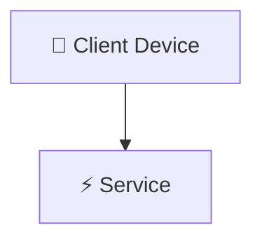

> 🧭 **Navigation**: [[00 - Homelab Hub|🏠 Homelab Hub]] ➔ [[00 - Architecture MOC|📐 Architecture]] ➔ **{{title}}**

# 📐 Architecture Spec: {{title}}

## 🎯 Purpose & Scope

{{scope_text}}

---

## 🗺️ System Blueprint & Data Flow

---

## 🔒 Security & Isolation Considerations

- {{security_point_1}}

---

## 🔗 Related Notes
- [[00 - Architecture MOC|Architecture MOC]]
- [[00 - Homelab Hub|Homelab Hub]]
